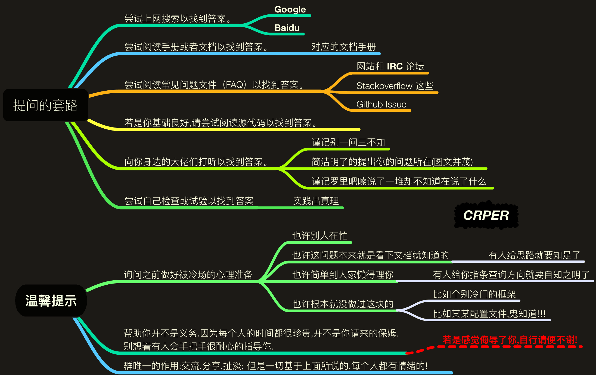

# 导航

## 推荐资源

- [CS-Notes](https://cyc2018.github.io/CS-Notes/)

  Github 上排名靠前的计算机专业课程笔记，简洁、美观、系统。

- Java：

  - [**遇见狂神说**](https://space.bilibili.com/95256449)

  Java 后端开发系列，学完他的全部课程找工作基本没问题。

  专注后端、前端也有讲解。

  后面的许多笔记来自他的课程。

- [菜鸟教程](https://www.runoob.com/)

- 计算机基础课程

  - 数据结构
  - 操作系统
  - 计算机网络原理
  - 计算机组成原理

- Android

  - [【天哥】Android 开发视频教程最新版 Android Studio 开发](https://www.bilibili.com/video/BV1Rt411e76H)

    和其他安卓课程区别在：对布局的讲解比较简单明白

    让我看了两三集就喜欢上他的课程。

- Youtube 上搜一些快速入门的视频

  - [freeCodeCamp](https://www.youtube.com/c/Freecodecamp)

## 使用流程

- Typora

  一款好用的 Markdown 笔记软件，Windows macOS Linux 都可以使用

- vuePress + GitPages + Travis Ci
  - vuePress 将 Markdown 渲染成静态网页。
  - GitPages 将 Github 仓库里的的静态网页制作成网站
  - Travis Ci：一个项目自动构建、持续集成机器人，当探测到 Github 仓库有新的 commit 之后下载、构建、上传项目到 gh-pages 分支。

三者结合可以达到如下效果：

1. 当你在本地编辑了 Markdown 文件后，通过 git commit & push 到 Github， 稍等片刻，你的网站上就能看到效果，自动更新。
2. 完全免费。不需要任何费用，当然需要花费一点点时间成本，适合长期使用。
3. 不过由于国内原因，可能访问有时会出现问题，这时候需要一些正确的上网姿势或者试试国内的 Gitee，不过由于个人偏好问题，暂时只会使用 Gitpages。

### 其他

由于之前写了很多笔记之后才使用

vuePress + GitPages + Travis Ci 做成网站供自己使用

所以之前的笔记不系统、排版乱。有些觉得没必要的笔记就没记。

后期的笔记将逐渐改善。

如果你对 vuePress + GitPages + Travis Ci 感兴趣，可以参考

- [**vuePress + GitPages + Travis Ci + MarkDown 笔记网站实现过程**](cs/frontend/vuePress.md)

## 文本内容基本框架

```markdown
# 文件名

## 参考

参考资料 可以是网址、书籍名称 ISBN 书籍 PDF 地址等信息、视频地址、自由发挥

## 待解决问题

没解决的问题，解决之后放到经验总结

## 经验总结（已解决问题）

写出自己学习过程中遇到的问题以及解决办法，作为以后的参考

## 正文
```

---

```markdown
# 文件名

## 参考

## 待解决问题

## 经验总结（已解决问题）

## 正文
```

## 排版

- [中文文案排版指北](https://github.com/sparanoid/chinese-copywriting-guidelines/blob/master/README.zh-CN.md)

  - 英文中文前后加一个空格
  - 数字和中文或英文之间加一个空格
  - 数字和单位之间加一个空格
  - 中文标点不用加空格，英文需要
  - 专有名词一般是首字母大写，大小写别写错
    - macOS
    - GitHub
    - Java
    - Python
    - JavaScript
    - Linux
    - Windows
    - ARM
    - Nvidia
  - 可以使用 VSCode 插件，保存即可格式化

- 标题和序号

  写清楚二级标题，方便生成导航栏，左侧导航栏不显示一级标题，所以最小用二级标题，一级标题一般用于文档最开头，和文件名相同（在 Github 新建仓库生成 README.md 文件时就是这样）

  序号方便写作时的排版。

- 代码和代码块

  - 代码要选对语言。

  - 两个代码块紧密相连，中间没有文字等隔开，需要用 `----------`

    隔开，否则两个代码块连在一起，体验不好

  - 代码块渲染貌似有问题，一个代码块后的部分内容可能也会被标识为代码块的内容，暂时没发现规律。

- 不闭合的标签

  - 所有带有标签的用 反引号 引住 （tab 键上的那个） 如 `<filename>`

    只要有 `<` `>` 标签都算，不管是不是 html 的标签。

    vuePress 在浏览器显示时，会检测标签是否闭合（可以用 vueDevTools 插 件查看控制台报错信息），如果有任何一个没闭合的，页面不会显示。

## 编码实践

- [代码可读性](https://github.com/CyC2018/CS-Notes/blob/master/notes/代码可读性.md)
- [代码风格规范](https://github.com/CyC2018/CS-Notes/blob/master/notes/代码风格规范.md)

## 如何提问

**如何科学提问：** 《[别像弱智一样提问](https://github.com/octowhale/Stop-Ask-Questions-The-Stupid-Ways/blob/master/README.md)》

**搜索引擎：** 为了你的身体健康、事业有成，请尽量**减少使用百度**的频率。




## 学习方法

1. 看视频快速入门

2. 多查阅文档，现学现用

3. 多思考，自信点

4. <font color=red>每个章节结束后做作业</font>

   只听不做跟没学差不多，费时费力。

5. 看高分书籍和官方英文文档以及博客深入和系统化

6. 查看开源项目

7. 查看框架源码

## 问题

- 学得太碎片化，没完整学完整套课程

- 学了没使用，用的时候没查阅文档，就感觉自己没学会，有种畏难心理。

  多查询文档，自信点，自信点，自信点。入门了之后要达到查看文档实现你想要的功能。
