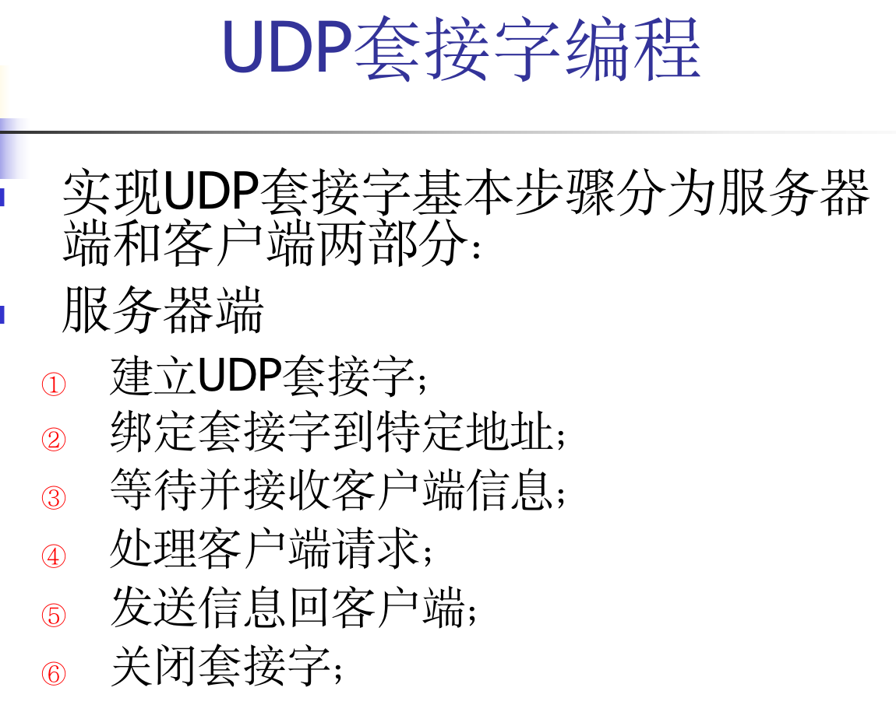

# Linux 网络编程上机实验

## 参考

[代码和提交文件 on Github ](https://github.com/chengziqaq/Note/tree/master/cs/Linux/linuxNetCode)

## 1.1 IP 地址转换函数

P18

```c
#include <arpa/inet.h>
#include <stdio.h>
#include <stdlib.h>
int main(int argc, char **argv){
    in_addr_t t;
    char *str;
    struct in_addr numstr;

    if (argc < 2 )
    {
        /* code */
        printf("Please input IP Address");
        exit(1);
    }

    t = inet_addr(argv[1]);
    printf("%x\n\r", t);
    inet_aton(argv[1], &numstr);
    printf("%x\n\r", numstr.s_addr);

    str = inet_ntoa(numstr);
    printf("%x\n\r", str);
    
}
```

-----

```c
#include <arpa/inet.h>
#include <stdio.h>

void main(){
    char buf[64];
    struct in_addr *in;
    // ipv6
    struct in6_addr *in6;

    inet_pton(AF_INET, "1.2.34.5", buf);
    in = (struct in_addr*)buf;
    printf("%x\n\r", in->s_addr);

    inet_pton(AF_INET6, "1234:5678::", buf);
    in6 = (struct in6_addr*)buf;

    for ( int i = 0; i < 16; i++)
    {
        printf("%02x", in6->s6_addr[i]);
        if ((i&&1) && (i<15) ){
             printf(":");
        }
    }
    printf("\n");
}
```

----

```shell
gcc -o v46 v46.c -std=c99 
```

---

.bash-history

```shell
ls
vi conv.c
cat conv.c
gcc -o conv conv.c
./conv 114.114.114.114
./conv 144.34.211.34
clear
vi v46.c
cat v46.c
gcc -o v46 v46.c
gcc -o v46 v46.c -std=c99
./v46 
./v46 
cp .bash_history bash.txtbsaftp
```

## 1.2 Windows 下 TCP 编程

### 1.2.1 基本代码

server.c

```c
// client.cpp : 定义控制台应用程序的入口点。
//

#include "stdafx.h"
#include "stdafx.h"
#include <stdio.h>
#include <winsock2.h>
#pragma comment(lib, "ws2_32.lib")

int _tmain(int argc, _TCHAR* argv[])
{
	sockaddr_in server;
	SOCKET fd; 
	WSADATA wsaData;
	WSAStartup(MAKEWORD(2, 2), &wsaData);
	fd = socket(AF_INET, SOCK_STREAM, 0);

	memset(&server, 0 , sizeof(server));
	//memset(&server, 0 , sizeof(sockaddr_in));
	server.sin_family = AF_INET;
	server.sin_port = htons(1234);
	server.sin_addr.S_un.S_addr = inet_addr("127.0.0.1");
	// Windows should use last function inet_addr,inet_aton did not work
	// inet_aton("127.0.0.1", &server.sin_addr);

	connect(fd, (sockaddr *)&server, sizeof(server));

	closesocket(fd);

	getchar();

	return 0;
}

```

client.c

```C
// net01.cpp : 定义控制台应用程序的入口点。
//

#include "stdafx.h"
#include <stdio.h>
#include <winsock2.h>
#pragma comment(lib, "ws2_32.lib")
// <> header: find in system lib
// "" header: first find in project file if not find then to find in system lib

int _tmain(int argc, _TCHAR* argv[])
{
	int len;
	SOCKET fd, clientfd;
	WSADATA wsaData;
	SOCKADDR_IN server, client;
	WSAStartup(MAKEWORD(2, 2), &wsaData);
	fd = socket(AF_INET, SOCK_STREAM, 0);

	memset(&server, 0, sizeof(server));

	server.sin_family = AF_INET;
	// port 1234
	server.sin_port = htons(1234);
	server.sin_addr.S_un.S_addr = htonl(INADDR_ANY);

	bind(fd, (sockaddr*)&server, sizeof(server));

	listen(fd, 5);

	len = sizeof(client);

	clientfd = accept(fd, (sockaddr*)&client, &len);

	printf("%s\n\r", inet_ntoa(client.sin_addr));

	closesocket(clientfd);
	closesocket(fd);

	getchar();

	return 0;
}


```

### 1.2.2 在基本代码上修改

- client.c 在连接后 connect(...) 加入代码

  [在线查看差异-client.c](https://github.com/chengziqaq/Note/commit/97fe12120f81ce6f417bbfca52a1f9ac9342baf1#diff-9d9936830bb5c6ba0a8c19033d7bd4805a147e85e0b65a90ae0836412d8417de)

  ```c
  send(fd, "hello", 5, 0);
  ```

  

- server.c 改得较多。

  [在线查看差异-server.c](https://github.com/chengziqaq/Note/commit/34f9fbde14129218596575a093b52f380fa1e872#diff-9d9936830bb5c6ba0a8c19033d7bd4805a147e85e0b65a90ae0836412d8417de)

## 1.3 Linux 下 UDP编程

### 1.3.1 单收单发

server.c 

```c
#include <stdio.h>
#include <string.h>
#include <unistd.h>
#include <sys/types.h>
#include <sys/socket.h>
#include <stdlib.h>
#include <netinet/in.h>
#include <arpa/inet.h>

void main(){
    int fd;
    char buf[100];
    int len, num;
    struct sockaddr_in server, client;

    fd = socket(AF_INET, SOCK_DGRAM, 0);

    memset(&server, 0, sizeof(server));
    server.sin_family = AF_INET;
    server.sin_port = htons(9999);
    server.sin_addr.s_addr = htonl(INADDR_ANY);
    bind(fd, (struct sockaddr*)&server, sizeof(server));
    
    len = sizeof(client);
    num = recvfrom(fd, buf, 100, 0, (struct sockaddr*)&client, &len);
    buf[num] = 0;
    printf("%s\n\r", buf);
    close(fd);
}

```

---

client.c

```c
#include <stdio.h>
#include <string.h>
#include <unistd.h>
#include <sys/types.h>
#include <sys/socket.h>
#include <stdlib.h>
#include <netinet/in.h>
#include <arpa/inet.h>

void main(){
    int fd;
    char buf[100];
    int len, num;
    struct sockaddr_in server, client;

    fd = socket(AF_INET, SOCK_DGRAM, 0);

    memset(&server, 0, sizeof(server));
    server.sin_family = AF_INET;
    server.sin_port = htons(9999);
    server.sin_addr.s_addr = inet_addr("127.0.0.1");
    
    strcpy(buf, "hello");
    num = sendto(fd, buf, strlen(buf), 0, (struct sockaddr*)&server, sizeof(server));
    printf("over\n\r");
    close(fd);
}

```

### 1.3.2 双方均可收发

server.c

```c
#include <stdio.h>
#include <string.h>
#include <unistd.h>
#include <sys/types.h>
#include <sys/socket.h>
#include <stdlib.h>
#include <netinet/in.h>
#include <arpa/inet.h>

void main()
{
	int fd;
	char buf[100];
	int len, num;
	struct sockaddr_in server, client;

	fd = socket(AF_INET, SOCK_DGRAM, 0);
	memset(&server, 0, sizeof(server));
	server.sin_family = AF_INET;
	server.sin_port   = htons(9999);
	server.sin_addr.s_addr = htonl(INADDR_ANY);
	bind(fd, (struct sockaddr*)&server, sizeof(server));
	
	len = sizeof(client);
	num=recvfrom(fd, buf, 100, 0,(struct sockaddr*)&client, &len);
	if(fork()>0)
	while(1)
	{
		num=recvfrom(fd, buf, 100, 0,(struct sockaddr*)&client, &len);
		buf[num] = 0;
		printf("%s", buf);
	}
	else
	while(1)
	{	
		fgets(buf, 100, stdin);
		printf("%s",buf);
		sendto(fd, buf, strlen(buf),0, (struct sockaddr*)&client, sizeof(client));
	}
	close(fd);
}

```

---

client.c

```c
#include <stdio.h>
#include <string.h>
#include <unistd.h>
#include <sys/types.h>
#include <sys/socket.h>
#include <stdlib.h>
#include <netinet/in.h>
#include <arpa/inet.h>

void main()
{
	int fd;
	char buf[100];
	int len, num;
	struct sockaddr_in server, client;

	fd = socket(AF_INET, SOCK_DGRAM, 0);
	memset(&server, 0, sizeof(server));
	server.sin_family = AF_INET;
	server.sin_port   = htons(9999);
	server.sin_addr.s_addr = inet_addr("127.0.0.1");
	
	sendto(fd, "start", 5, 0,(struct sockaddr*)&server, sizeof(server));
	if(fork()>0)
	while(1)
	{	
		fgets(buf, 100, stdin);
		sendto(fd, buf, strlen(buf), 0,(struct sockaddr*)&server, sizeof(server));
	}
	else
	while(1)
	{
		len = sizeof(server);
		num = recvfrom(fd, buf, 100, 0, (struct sockaddr*)&server, &len);
		buf[num] = 0;
		printf("RECV:%s", buf);
	}
	close(fd);
}

```

## 1.4 Windows下并发编程

### 1.4.1 简单例子

```c
// server.cpp : 定义控制台应用程序的入口点。
//

#include "stdafx.h"
#include <windows.h>
unsigned WINAPI Func(void *arg){
	while(1){
		Sleep(500);
		printf("thread\n");
	}
}

int _tmain(int argc, _TCHAR* argv[])
{
	CreateThread(NULL, 0,  (LPTHREAD_START_ROUTINE)Func, NULL, 0, NULL);
	while(1){
		Sleep(500);
		printf("main\n");

	}
	return 0;
}


```

---

### 1.4.2 烫烫烫烫

server.c

```c
// server.cpp : 定义控制台应用程序的入口点。
//

#include "stdafx.h"
#include <windows.h>
#include <winsock2.h>
#pragma comment(lib, "ws2_32.lib")

typedef struct _addr{
	SOCKET s;
	sockaddr_in client;
}ADDR;

__declspec(thread) SOCKET client_sock;
__declspec(thread) sockaddr_in client;

unsigned WINAPI SendFunc(void *arg)
{
	char buf[100];
	int len;
	SOCKET s = *((SOCKET*)arg);
	while(1)
	{
		fgets(buf, 100, stdin);
		len = strlen(buf);
		send(s, buf, len, 0);
	}
}

unsigned WINAPI Func(void * arg)
{
	char buf[100];
	int len;

	client_sock = ((ADDR*)arg)->s;
	memcpy(&client, &(((ADDR*)arg)->client), sizeof(client));
	printf("one client connected\n");
	CreateThread(NULL, 0, (LPTHREAD_START_ROUTINE)SendFunc, (LPVOID)&client_sock, 0, NULL);

	while(1){
		len = recv(client_sock, buf, 100, 0);
		buf[len] = 0;
		printf("%s", buf);
	}
	//closesocket(client_sock);
	return 0;
}

int _tmain(int argc, _TCHAR* argv[])
{
	WSADATA wsaData;
	SOCKET server_sock;
	int sock_len;
	sockaddr_in server;
	ADDR addr;

	WSAStartup(MAKEWORD(2, 2), &wsaData);

	server_sock = socket(AF_INET, SOCK_STREAM, 0);
	memset(&server, 0, sizeof(server));
	server.sin_family = AF_INET;
	server.sin_port = htons(9999);
	server.sin_addr.s_addr = htonl(INADDR_ANY);
	bind(server_sock, (sockaddr*)&server, sizeof(server));

	listen(server_sock, 128);
	
	sock_len = sizeof(client);
	while(1)
	{
		client_sock = accept(server_sock, (sockaddr*)&client,&sock_len);
		addr.s = client_sock;
		memcpy(&addr.client, &client, sizeof(client));
		CreateThread(NULL, 0, (LPTHREAD_START_ROUTINE)Func, (LPVOID)&addr, 0, NULL);
	}


	return 0;
}

```

---

client.c

```
// client.cpp : 定义控制台应用程序的入口点。
//

#include "stdafx.h"
#include <windows.h>
#include <winsock2.h>
#pragma comment(lib, "ws2_32.lib")

unsigned WINAPI recvFunc(void *arg)
{
	char buf[100];
	int len;
	SOCKET s = *((SOCKET*)arg);
	while(1)
	{
		len = recv(s, buf, 100, 0);
		buf[len] = 0;
		printf("%s", buf);
	}
}

int _tmain(int argc, _TCHAR* argv[])
{
	char buf[100];
	int len;
	WSADATA wsaData;
	SOCKET server_sock;
	sockaddr_in server;

	WSAStartup(MAKEWORD(2, 2), &wsaData);

	server_sock = socket(AF_INET, SOCK_STREAM, 0);
	memset(&server, 0, sizeof(server));
	server.sin_family = AF_INET;
	server.sin_port = htons(9999);
	server.sin_addr.s_addr = inet_addr("127.0.0.1");

	connect(server_sock, (sockaddr*)&server, sizeof(server));
	CreateThread(NULL, 0, (LPTHREAD_START_ROUTINE)recvFunc, (LPVOID)&server_sock, 0, NULL);


	while(1)
	{
		fgets(buf, 100, stdin);
		len = strlen(buf);
		send(server_sock, buf, len, 0);
	}
	closesocket(server_sock);
	return 0;
}


```

---

```c
// server.cpp : 定义控制台应用程序的入口点。
//

#include "stdafx.h"
#include <windows.h>
#include <winsock2.h>
#pragma comment(lib, "ws2_32.lib")

typedef struct _addr{
	SOCKET s;
	sockaddr_in client;
}ADDR;

__declspec(thread) SOCKET client_sock;
__declspec(thread) sockaddr_in client;

unsigned WINAPI SendFunc(void *arg)
{
	char buf[100];
	int len;
	SOCKET s = *((SOCKET*)arg);
	while(1)
	{
		fgets(buf, 100, stdin);
		len = strlen(buf);
		send(s, buf, len, 0);
	}
}

unsigned WINAPI Func(void * arg)
{
	char buf[100];
	int len;

	client_sock = ((ADDR*)arg)->s;
	memcpy(&client, &(((ADDR*)arg)->client), sizeof(client));
	printf("one client connected\n");
	CreateThread(NULL, 0, (LPTHREAD_START_ROUTINE)SendFunc, (LPVOID)&client_sock, 0, NULL);

	while(1){
		len = recv(client_sock, buf, 100, 0);
		buf[len] = 0;
		printf("%s", buf);
	}
	//closesocket(client_sock);
	return 0;
}

int _tmain(int argc, _TCHAR* argv[])
{
	WSADATA wsaData;
	SOCKET server_sock;
	int sock_len;
	sockaddr_in server;
	ADDR addr;

	WSAStartup(MAKEWORD(2, 2), &wsaData);

	server_sock = socket(AF_INET, SOCK_STREAM, 0);
	memset(&server, 0, sizeof(server));
	server.sin_family = AF_INET;
	server.sin_port = htons(9999);
	server.sin_addr.s_addr = htonl(INADDR_ANY);
	bind(server_sock, (sockaddr*)&server, sizeof(server));

	listen(server_sock, 128);
	
	sock_len = sizeof(client);
	while(1)
	{
		client_sock = accept(server_sock, (sockaddr*)&client,&sock_len);
		addr.s = client_sock;
		memcpy(&addr.client, &client, sizeof(client));
		CreateThread(NULL, 0, (LPTHREAD_START_ROUTINE)Func, (LPVOID)&addr, 0, NULL);
	}


	return 0;
}


```

---

```c
// client.cpp : 定义控制台应用程序的入口点。
//

#include "stdafx.h"
#include <windows.h>
#include <winsock2.h>
#pragma comment(lib, "ws2_32.lib")

unsigned WINAPI recvFunc(void *arg)
{
	char buf[100];
	int len;
	SOCKET s = *((SOCKET*)arg);
	while(1)
	{
		len = recv(s, buf, 100, 0);
		buf[len] = 0;
		printf("%s", buf);
	}
}

int _tmain(int argc, _TCHAR* argv[])
{
	char buf[100];
	int len;
	WSADATA wsaData;
	SOCKET server_sock;
	sockaddr_in server;

	WSAStartup(MAKEWORD(2, 2), &wsaData);

	server_sock = socket(AF_INET, SOCK_STREAM, 0);
	memset(&server, 0, sizeof(server));
	server.sin_family = AF_INET;
	server.sin_port = htons(9999);
	server.sin_addr.s_addr = inet_addr("127.0.0.1");

	connect(server_sock, (sockaddr*)&server, sizeof(server));
	CreateThread(NULL, 0, (LPTHREAD_START_ROUTINE)recvFunc, (LPVOID)&server_sock, 0, NULL);


	while(1)
	{
		fgets(buf, 100, stdin);
		len = strlen(buf);
		send(server_sock, buf, len, 0);
	}
	closesocket(server_sock);
	return 0;
}


```
## Linux 下多线程网络编程
netcat TCP/IP的瑞士军刀

[代码地址](https://github.com/DayoWong0/Note/tree/master/cs/Linux/linuxNetCode/course04)

## Windows 

[代码地址](https://github.com/DayoWong0/Note/tree/master/cs/Linux/linuxNetCode/course05)

获取 域名信息

```c
// name.cpp : 定义控制台应用程序的入口点。
//

#include "stdafx.h"
#include <stdlib.h>
#include <winsock2.h>

#pragma comment(lib, "ws2_32.lib")

int main(int argc, char* argv[])
{
	WSADATA wsaData;
	WSAStartup(MAKEWORD(2, 2), &wsaData);
	
	struct hostent  *hp;
	char **p;
	unsigned int addr;
	char name[1024];

	//hp = gethostbyname("www.taobao.com");
	addr = inet_addr("211.67.48.2");
	hp = gethostbyaddr((char*)&addr,4, AF_INET );
	gethostname(name, sizeof(name));
	puts(name);

	if(hp == NULL)
	{
		exit(2);
	}
	for(p = hp->h_addr_list; *p!=0; p++)
	{
		struct in_addr in;
		char **q;
		memcpy(&in.s_addr, *p, sizeof(in.s_addr));
		printf("%s\t%s", inet_ntoa(in), hp->h_name);
		for(q=hp->h_aliases; *q!=0; q++)
			printf("%s", *q);
		putchar('\n');
	}


	getchar();
	return 0;
}


```

---

```c
// getaddrinfo.cpp : 定义控制台应用程序的入口点。
//

#include "stdafx.h"

#include <stdio.h>
#include <WinSock2.h>
#include <WS2tcpip.h>

#pragma comment(lib,"ws2_32.lib")

int main(int argc, char *argv[])
{
	//初始化环境
	WSADATA ws;
	WSAStartup(MAKEWORD(2, 2), &ws);


	struct addrinfo hints;
	struct addrinfo *res, *cur;
	struct sockaddr_in *addr;
	// 保存Ip地址信息 xxx.xxx.xxx.xxx
	char m_IpAddr[16];

	//初始化 hints
	memset(&hints, 0, sizeof(addrinfo));
	hints.ai_family = AF_INET;	//IPv4
	hints.ai_flags = AI_PASSIVE; //匹配所有 IP 地址
	hints.ai_protocol = 0;        //匹配所有协议
	hints.ai_socktype = SOCK_STREAM; //流类型

	//获取 ip address ， res 指向一个链表Address Information链表
	int ret = getaddrinfo("www.baidu.com", NULL, &hints, &res);
	if (ret == -1)
	{
		perror("getaddrinfo");
		exit(-1);
	}

	//输出获取的信息
	for (cur = res; cur != NULL; cur = cur->ai_next)
	{
		addr = (struct sockaddr_in *) cur->ai_addr; //获取当前 address

		sprintf(m_IpAddr, "%d.%d.%d.%d", addr->sin_addr.S_un.S_un_b.s_b1,
			addr->sin_addr.S_un.S_un_b.s_b2,
			addr->sin_addr.S_un.S_un_b.s_b3,
			addr->sin_addr.S_un.S_un_b.s_b4);

		printf("%s\n", m_IpAddr); //输出到控制台
	}
	//清除环境信息
	WSACleanup();
	system("pause");
	return 0;
}
```


# 复习

## 第02章 基本套接口编程

这一章内容和下一章内容联系紧密

### 套接字结构


#### 总结

- INET：IP版本4
  INET6：IP版本6

  SOCKET_STREAM：双向可靠数据流，对应TCP
  SOCKET_DGRAM：双向不可靠数据报，对应UDP
  SOCKET_RAW：原始套接字。使用时需要 root 权限。

- 套接字有两种结构：IPv4 和 IPv6，在使用套接字函数时（下一章的内容），需要将 IPv4 或者 IPv6 结构指针 转为 通用套接字地址结构指针类型。

  如

  ```c
  struct sockaddr_in  serv
  bind(sockfd, (struct sockaddr *)&serv,sizeof(serv));
  ```

- 套接字结构中，IP 地址位于结构中的结构

  ```c
  struct sockaddr_in  serv
  // IP 地址  
  serv.sin_addr.s_addr
  ```

  

### 字节排序函数


```c
#include <netinet/in.h>
uint16_t  htons(uint16_t hostshort)
uint32_t  htonl(uint32_t hostlong)
// 均返回：网络字节序值

uint16_t  ntohs(uint16_t netshort)
uint32_t  ntohl(uint32_t netlong)
// 均返回：主机字节序值
// h:主机 host  n:网络, network  s:短整数 short  l:长整数 long

```

计算机内存有大端和小端存储方式，为了屏蔽这种差异，需要用到 `字节排序函数`，将他们转换为统一的格式。

- htons：host to network short，主机地址转为网络地址（short int 类型）

  填充端口信息需要用此函数

  ```c
  // IPv4 地址结构体
  struct sockaddr_in server;
  server.sin_port = htons(1234);
  ```

- htonl

  l 时 long int，其他同上。

  填充服务器 IP 地址时用此函数。

- ntohs、ntohl

  htons 逆函数

### 字节操纵函数

```c
#include <string.h>
void bzero(void *dest, size_t nbytes);
void bcopy(const void *src, void *dest, size_t nbytes);
int   bcmp(const void *src, void *dest, size_t nbytes); /*返回0则相同，非0不相同*/
                                             //上述三个函数源自BSD
void *memset(void *dest, int c, size_t len);
void *memcpy(void *dest, const void *src, size_t nbytes);
int     memcmp(const void *ptr1, const void *ptr2, size_t nbytes)
					//上述三个函数属于ANSI C

```

#### 作用

都是对内存中字节的操作。

- bzero()

  将目标中的指定数目的字节重置为 0。进行套接字初始化。

- bcopy

  复制字节

- bcmp

  比较字节是否相同

- 参考 P17

- 上面三个函数和下面三个函数作用类似。
  - 参数位置不一样
  - 返回结果不一样
  - 书上的例子用的 bzero，老师喜欢用 memset，不知道是不是因为用到了 Windows 下的网络编程），因为 memset 那三个函数是 C 语言提供，不是由 Linux 系统提供的，通用性更好。

### IP 地址转换函数


函数中 a 是 ASCII。n 是 numeric（数值），是存放于套接字地址结构中的二进制值。

这两个函数只能处理 IPv4 地址

- inet_aton

  将点分十进制 IP 地址转为 套接字结构中的二进制地址。

- inet_ntoa

  和上面的相反


p 代表什么书上没说，n 依然是二进制数值。

这两个函数可以处理 IPv4 和 IPv6 函数


## 第03章 基本TCP套接口编程

还是看 ppt 和书。写这笔记就相当于简单的复制粘贴截图，写了也不会怎么看的。


## 第04章 基本UDP套接口编程




## 第05章 并发服务器

```c
#include <sys/types.h>
#include <unistd.h>
pid_t fork(void)
```

返回：父进程中返回子进程的进程ID, 子进程返回0，
           -1－出错

- <font color=red>fork后，子进程和父进程继续执行fork（）函数后的指令。</font>

- 子进程是父进程的副本。子进程拥有父进程的数据空间、堆栈的副本。但父、子进程并不共享这些存储空间部分。如果代码段是只读的，则父子进程共享代码段。如果父子进程同时对同一文件描述字操作，而又没有任何形式的同步，则会出现混乱的状况；
  父进程中调用fork之前打开的所有描述字在函数fork返回之后子进程会得到一个副本。fork后，父子进程均需要将自己不使用的描述字关闭。


## 第06章名字与地址转换编程

### gethostbyname()函数

- 找主机名最基本的函数gethostbyname()，该函数执行如果成功，它返回一个指向结构hostent的指针，该结构中包含了该主机的所有IPv4地址或IPv6地址；如果失败返回空指针。

- ```c
  include <netdb.h>
  struct hostent * gethostbyname (const char  *  hostname);
  ```

  参数hostname是主机的域名地址，函数将查询的结果作为参数返回。

  如果失败返回空指针；

  如果成功此参数返回的非空指针指向如下的hostent结构：

## 第07章IPv4和IPv6编程

## 第08章 守护进程和inetd超级服务器

后台程序拥有控制终端，和守护进程不同。

## 第09章IO编程

## 第10章 广播与多播编程

## 第11章 路由套接字编程

## 第12章信号量编程

## 第13章 原始套接字与数据链路访问编程

