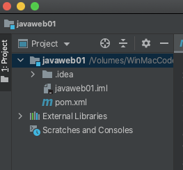
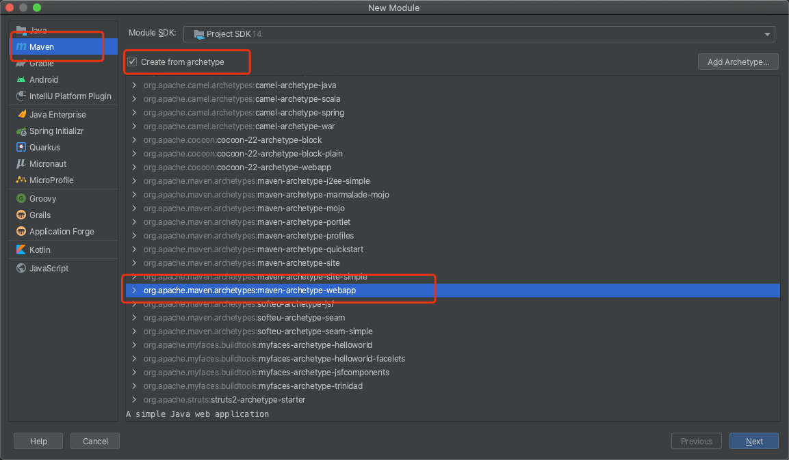
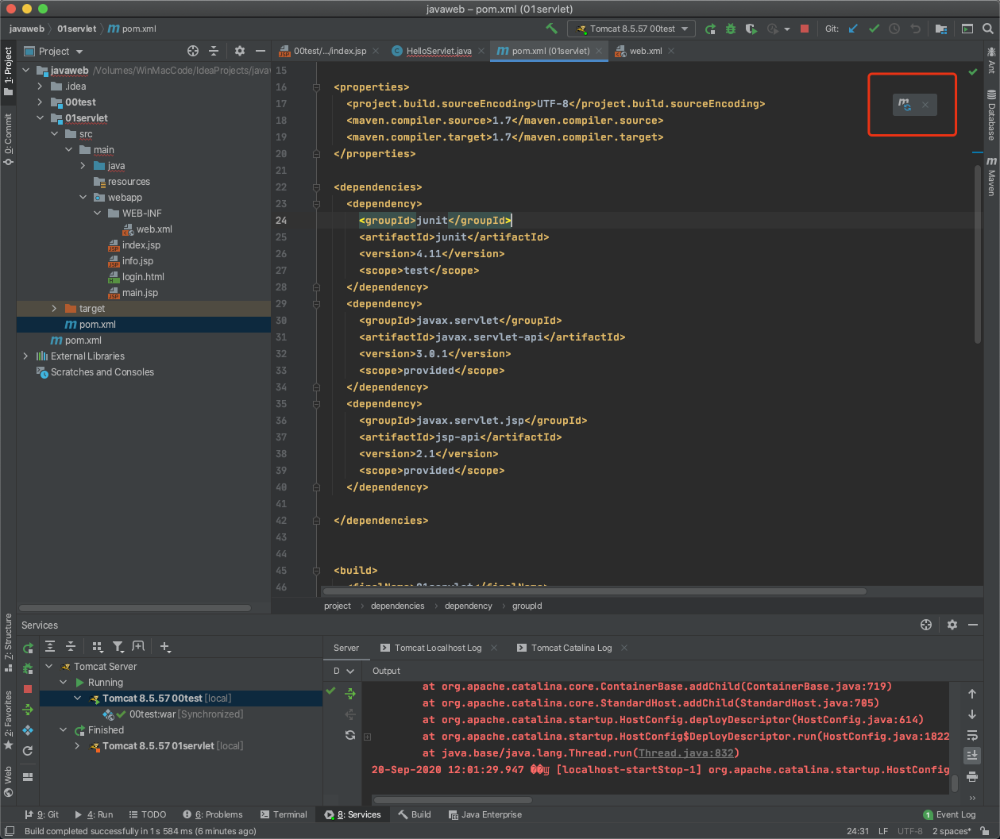
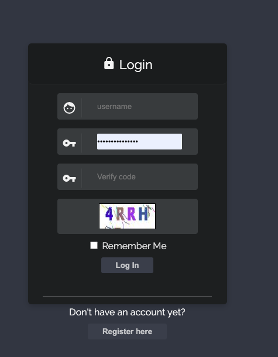

# Java Web -ng-02

## 部署方式

三种

1.

2.

3.

## 项目文件存放目录

### 前端

- 静态文件:

  html 根目录

  - js/

  - css/

  - image/

- 动态文件:

  \*.jsp

### 后端

均放于 WEB-INF 目录下

WEB-INF

classes: 按源代码的结构编译好的\*.class 文件

lib: 存放程序所需要的包(\*.jar)

web.xml: 本应用配置文件

## idea web 项目创建

out.flush: 立即输出, 不用等待缓存完毕就输出

## 配置文件解析

### web.xml

## 问题

1. 三种 web 服务器配置方法(主要用第三种方法)
2. idea 生成的文件太少, 以及怎么在 idea 上配置开发环境
3. 配置文件的作用

## 作业

1. 重现一次访问
2. DAO 数据库写好
3.

## 总结

配置文件:

web.xml 中的

<servelet-mapping>

</servelet-mapping>

## servelet

教材 P19

## html

1. p 标签自动换行

2. span 不换行换行

3. 列表

   无序<ul></ul>

   有序<ol></ol>

4. 表格

   ```html
   <table>
     <tr>
       <td></td>
     </tr>
   </table>
   ```

## HTTP 方法

GET: 不安全 有长度限制

POST:

POST 请求时, 客户端发送非西文数据时使用编码: iso 8859-1

服务端需要将此编码转换为 UTF-8 编码.

转换方法:

两种方法搭配使用

1. 调用 request 对象提供的方法

   ```java
   request.setCharacterEncoding("utf-8");
   ```

2. 手工编码 可对单个数据编码进行转换

# javaweb-03

## 地址映射

1. 注解

   例子

   在类名前加入注解 @WebServlet("/test")

   redeploy 服务器

   访问 http://localhost:8080/javaweb_02_servlet_war/test

   **注意**:

   - 注解中 @WebServlet("/test")

     test 前面的斜杠不能忘记, 否则 tomcat 会启动失败. 上课时困扰了我至少 20 分钟

2. 配置文件

## 用户登录案例

- 用户名 密码 验证码

## 出错

### url 地址写错

正确写法:

```java
@WebServlet(urlPatterns = "/controller/vcode.do")

public class CreateVerifyCodeImagesServlet extends HttpServlet {
    @Override
    protected void doGet(HttpServletRequest req, HttpServletResponse resp) throws ServletException, IOException {
//        System.out.println("验证码");
    }
}
```

出错原因, urlPatterns 参数要以 "/" 开头.

```java
// 错误写法
@WebServlet(urlPatterns = "controller/vcode.do")
//正确写法
@WebServlet(urlPatterns = "/controller/vcode.do")
```

# 作业 1 复习笔记

### 4.2 虚拟目录的配置

#### 定义: 建立 URL 地址与项目的物理路径之间的映射，这个过程叫做虚拟路径的映射。

例如：在浏览器中输入地址 [http://localhost:8080/test/index.html](http://localhost:8080/test/index.html)服务器必须知道/test（虚拟目录）这个目录对应服务器中的哪个物理目录

有三种方法, 方法 3 用的多, 主要看它.

#### 配置方法 3

在 $Tomcat_home$\conf\Catalina\localhost 路径下新建一个 XML 文件（conf 目录下如果没有对应子目录，请手工新建），注意：XML 文件的名字必须和定义的虚拟目录名一致，在下例中，文件名必须为 test.xml，文件内容如下:

```xml
<Context path="/test" docBase="/Volumes/WinMacCode/IdeaProjects/javaweb/javaweb-02-servlet/src/main/webapp" reloadable="true">
</Context>
```

浏览器中输入 http://127.0.0.1:8080/test/index.html 也可访问到 d:/myweb/index.html 文件

推荐使用第三种配置方法，对于该种配置方法，web 应用程序可以存放在服务器的任何位置，每个应用一个单独的配置文件。

#### 注意

1. test 为虚拟目录
2. xml 配置文件的 docBase 是静态文件 html css js 的目录(docBase 目录需要改为你自己的静态文件夹目录)
3. reloadable 表示热部署. 文件发生改变 tomcat 自动重启

### IDEA Maven 新建项目

#### 参考

1. [javaweb-06：IDEA 中 Maven 的操作](https://www.bilibili.com/video/BV12J411M7Sj?p=60)

2. [IDEA 2020 创建 Maven web 项目](https://blog.csdn.net/m0_46587577/article/details/107290521)


输入项目名称, 然后一路下一步, 等待 maven 运行完成

因为我想在一个文件夹下能有多个项目. 需要做以下操作.

1. 删除 src 目录

   删除后目录结构

   

2. 左键点击项目名称--> 右键单击 --> new --> module

   

   进行和开始新建项目同样的操作



这里项目名我填入为 web01servlet, 然后一路默认下一步, 再次等待 maven 跑完


3. 添加 tomcat 服务器配置

   参考 [IDEA 集成 Tomcat ](https://blog.csdn.net/fengchao2016/article/details/83023725)

   当静态文件改变和 java 代码改变后 需要 restart server

   ~~当 java 文件改变后 需要 redeploy~~


4. 在 src 下 新建 目录 java 和 resources

   

5. 在 maven 中添加 servlet 依赖.

   打开子项目里的 pom.xml 粘贴以下内容到 dependencies 下级去, 然后点击 maven 图标 下载依赖包

   ```xml
   	<dependency>
           <groupId>junit</groupId>
           <artifactId>junit</artifactId>
           <version>4.11</version>
           <scope>test</scope>
       </dependency>
       <dependency>
           <groupId>javax.servlet</groupId>
           <artifactId>javax.servlet-api</artifactId>
           <version>3.0.1</version>
           <scope>provided</scope>
       </dependency>
       <dependency>
           <groupId>javax.servlet.jsp</groupId>
           <artifactId>jsp-api</artifactId>
           <version>2.1</version>
           <scope>provided</scope>
       </dependency>
   ```

### 以下内容是用 maven 的父结构 未完成 待补充




### 结束

6. 上课时跟着老师敲了一部分代码. 现在跟着文档完善一下.

然后启动服务器.

---

9.21 晚上补充

### 验证码动态生成

照着老师的文档的代码敲了一遍

生成验证码的代码完成.

需要自己看的有 java 怎么绘画验证码.

有一个地方需要修改.

```java
//CreateVerifyImageController中
resp.setContentType("image/jpeg");
//老师的代码 中 img = image 基本问题也不大, 但是用谷歌浏览器打开网址, 他会当做文件来下载, 强迫症犯了..通过一个我经常用的网站看到 返回类型该改为image/jepg
```

验证码放于 session 中

在 github 找了个前端注册登录代码 改了一下 效果如下, 修改了 js 代码 点击图片刷新验证码也行了

还需要修改 css 使得验证码和输入框位于同一个行内



### 登录出错页面

[出错前端模板](https://github.com/HttpErrorPages/HttpErrorPages/tree/master/dist)

html 文件名字有大写的 tomcat 不能查看 显示 404?

后来又行了? 令人迷惑.

可能是缓存问题, 但是我也 restart server 并且 redeploy

又来了更迷惑的事情.

同一个文件夹下

HTTP500.html 不能访问

HTTP404.html 可以访问

## el 表达式不显示

需要在 jsp 文件前面加入以下代码

参考: [EL 表达式无法显示，直接显示\${xxx}](https://blog.csdn.net/lianzhang861/article/details/81232351)

```jsp
<%@ page isELIgnored="false" %>
```

```java
@WebServlet(value = "/controller/login.do", name = "login.do")
public class LoginController extends HttpServlet {
    @Override
    protected void doGet(HttpServletRequest req, HttpServletResponse resp) throws IOException, ServletException {
        String login_info ="test";
        req.setAttribute("login_info", login_info);
        req.getRequestDispatcher("/error.jsp").forward(req, resp);
    }
```

```jsp
<%@ page language="java" pageEncoding="UTF-8" %>
<%@ page isELIgnored="false" %>
<!DOCTYPE HTML>
<html>
<head>
    <meta charset="UTF-8">
    <title>JSP显示Servlet</title>
</head>
<body>
    ${login_info}
</body>
</html>
```

## 访问网址错误导致 jstl 和 el 数据不显示

正确的访问网址为

/getDownloadList.do

但是我在测试的时候直接访问的 /download.jsp 是不正确的

servlet 需要传数据给 jsp 文件, 若直接访问 jsp 文件, 没有这个过程,没数据传入,则没有显示.

只有访问 /getDownloadList.do 才能使得 jsp 文件得到数据

# 第三周课

### MVC 模型

- Model 模型

  数据库相关 JavaBean

- View 视图

- Controller 控制器

和 Django 的 MVC 一样

Model 和数据库相关

View 响应和数据处理

### Servlet

中间层

#### servlet 方法

各种方法需要的参数以及返回值可以看源码或者教材

1. init

   首次启动调用.

2. destroy

   卸载时调用.

3. service

   顾名思义 服务是一直运行着的

   - doPost

   - doGet

### 新建 servlet

参考 [使用 IntelliJ IDEA 新建一个 Servlet 项目](https://blog.csdn.net/chang_ge/article/details/79917956)

#### 两种 URL 映射方法

参考

[Intellij idea 创建 javaWeb 以及 Servlet 简单实现](https://blog.csdn.net/yhao2014/article/details/45740111)

1. web.xml 配置文件

   ```xml
   <!--  注册HelloServlet开始-->
     <servlet>
       <servlet-name>hello</servlet-name>
   <!--    类名-->
       <servlet-class>controller.HelloServlet</servlet-class>
     </servlet>
   <!--  servlet请求路径-->
     <servlet-mapping>
       <servlet-name>hello</servlet-name>
   <!--    虚拟路径-->
       <url-pattern>/hello</url-pattern>
     </servlet-mapping>
   <!--  注册HelloServlet结束-->
   ```

2) 注解

   在 类名 上注解

   ```java
   @WebServlet(value = "/HelloServlet", name = "HelloServlet")
   public class HelloServlet extends HttpServlet {

       @Override
       protected void doGet(HttpServletRequest req, HttpServletResponse resp) throws IOException {
   //        ServletOutputStream outputStream = resp.getOutputStream();
           PrintWriter writer = resp.getWriter();//响应流
           writer.println("hello servlet changed");
       }

       @Override
       protected void doPost(HttpServletRequest req, HttpServletResponse resp) throws  IOException {
           doGet(req, resp);
       }
   }
   ```

两者选一个就行, 注解用得多些

### HttpServletRequest 对象

### **获得客户机请求头**

### 获得客户机请求参数

# 第四周课

- 前端页面网址 没有斜杠开头 后端却是以斜杠开头(web.xml 配置文件 和 类名上的注解 )

## JSP (Java Server Page)

动态页面, html 文件里嵌入 Java 代码

### 语法格式

<%@ 指令名 attribute1="value1" %>

教材 P49

和 Django 的模板语言类似

服务器可以返回 基本数据类型 对象 集合等

jstl uri 在包内没找到

解决

[配置 Jstl 的 Maven 依赖](https://blog.csdn.net/qq_29227939/article/details/52063869)

但是这个 maven 配置直接复制过来 有 Maven 依赖重复问题

使用 fo 循环

body 中

```html
<body>
  <c:forEach items="${downloadList}" var="download">
    
    <p>${download.description}</p>
  </c:forEach>
</body>
```

jsp 里最好别写代码. 多数用来数据展示。

## 流程控制

(不推荐用 JSP 做流程控制)

必须要写 Java 代码, 后期可以使用 过滤器 简化

若用到了 Java 中的 类 需要在头文件 import 该类

## 数据库

[IDEA Maven mysql 数据库操作 有 java 代码例子](https://www.cnblogs.com/dadian/p/11938707.html)

没安装数据库.

代码位于 src/main/java/DAO/UserDAO.java 中

# 第五周课

## 过滤器

访问控制, 拦截请求, 对请求重新编码和压缩响应信息等

### filter 配置

- web.xml 配置

  filter 和 filter-mapping 标记

  支持通配符

- 注解

  ```java
  @WebFilter(urlPattterns = {"@"})
  ```

  可加入初始化参数

注意: 过滤器过滤的路径不包括前端静态文件(即对 html css js 无效). 对 jsp 有效

- 过滤器使用

- 为了减少硬编码, 可以使用配置文件, 但是和注解比较起来, 较麻烦.

# 第六周课 AJAX

### JSON

1. JSON内部包含的字符串必须要用双引号。
2. JSON 数组 JSON 对象

合格的 JSON 对象

```json
["one", "two", "three"]
{ "one": 1, "two": 2, "three": 3 }
{"names": ["张三", "李四"] }
[ { "name": "张三"}, {"name": "李四"} ]　
```


# 作业2笔记

## 1. web.xml 配置文件报错

```xml
<!DOCTYPE web-app PUBLIC
 "-//Sun Microsystems, Inc.//DTD Web Application 2.3//EN"
 "http://java.sun.com/dtd/web-app_2_3.dtd" >

<web-app>
  <display-name>Archetype Created Web Application</display-name>

  <!-- 定义Filter -->
  <filter>
    <!-- Filter的名字 -->
    <filter-name>permissionCheckFilter</filter-name>
    <!-- Filter的实现类 -->
    <filter-class>filter.PermissionFilter</filter-class>
    <!-- 下面3个init-param元素配置了3个参数 -->
    <init-param>
      <param-name>notCheckPath</param-name>
      <param-value>/createberifyImage.do, /login.do, /logout.do, /error.jsp</param-value>
    </init-param>
  </filter>
  <!-- 定义Filter拦截的URL地址 -->
  <filter-mapping>
    <!-- Filter的名字 -->
    <filter-name>permissionCheckFilter</filter-name>
    <!-- Filter负责拦截的URL -->
    <url-pattern>*.jsp</url-pattern>
    <url-pattern>*.do</url-pattern>
  </filter-mapping>

</web-app>
```

错误: The content of element type "filter-mapping" must match

解决:

[解决：The content of element type "web-app" must match "(icon?,display-](https://www.iteye.com/blog/jyao-1263650)

接着 测试 过滤器效果, 发现打开 login.html 404

删除了 target 文件 重新启动解决了 原因未知


## 2. 验证码不加载

不过滤的地址配置错误 由于我自己的创建验证码的地址和老师给的参考代码不一样.

修改之后启动还是不能加载. 查看后发现前端地址有问题 

后端地址注解

```
/createVerifyImage.do
```

前端

```
createVerifyImage.do
```

前端不能加 "/" 否则会变为绝对路径, 而后端却必须要加, 不然启动服务器还会出错.

接着点击验证码切换新的 又不能加载.

原因: Javascript 代码没修改.

修改 js 代码后还是出错

又是前端相对路径前面不能 加 " / "

#### 总结

1. 前端相对路径开头不能有 "/", 后端路径注解必须有
2. 项目开始写代码之前, 路径这些得先确定下来, 开发过程中修改费时间还容易出问题.

## Cookie 和 Session

1. 只要注意 cookie的 path 加上项目名就行
2. 广告的精确推送使用 cookie 以前没想到过

#### session 和 cookie 记住用户登录状态

用户登录状态在服务端记录才安全. Cookie 用于记住用户名, 

是否登录( 次要, 最终还要在服务端用 session 验证一次 ).

参考:

[java利用Session实现三天免登录](https://blog.csdn.net/huanyinghanlang/article/details/79061802)

主要看这: 勾选了记住我 submit 传过来得数值为 1 .

```java
String remember = req.getParameter("remember");

if (remember != null && remember.equals("1")) {// 需要记住密码
				// 将用户名和密码存放在cookie对象中
				Cookie cookie = new Cookie("userInfo", uname + ":" + pwd);
				// 设置有效时间三天
				cookie.setMaxAge(3 * 24 * 60 * 60);
				// 设置有效页面
				cookie.setPath("/uwo9/login.jsp");
				// 将cookie对象存放至response
				resp.addCookie(cookie);
```

### 读取 cookie

需要先进行类型转换再得到 cookie 

```java
HttpServletRequest request = (HttpServletRequest) req;
Cookie[] cookies = request.getCookies();
```

同理, 设置 cookie 需要

```java
HttpServletResponse  response= (HttpServletResponse) resp;
```

字符串分割取 cookie 里面的用户名和密码

参考:


[JAVA删除Cookie](https://blog.csdn.net/qq_39668217/article/details/87733608?utm_medium=distribute.pc_relevant_t0.none-task-blog-BlogCommendFromMachineLearnPai2-1.channel_param&depth_1-utm_source=distribute.pc_relevant_t0.none-task-blog-BlogCommendFromMachineLearnPai2-1.channel_param)

[Java split() 方法](https://www.runoob.com/java/java-string-split.html)

## 权限分配实现

这个难点在于数据库的设计, 不过老师给了数据库设计结构. 多对多结构

关键数据库查询语句


查询当前登录用户所属的角色，然后查询这些角色拥有权限, 连续查询以前没用过.

```mysql
SELECT
	*
FROM
	t_resource
WHERE
	resourceId IN (
		SELECT
			resourceId
		FROM
			t_role_resource
		WHERE
			roleId IN (
				SELECT
					roleId
				FROM
					t_user_role
				WHERE
					userName = ?
			)
	)
```

#   第七周课

## JSON

- JSON.parse(): 用于将一个 JSON 字符串转换为 JavaScript 对象　

  ```javascript
  JSON.parse('{"name":"alex"}');
  
  JSON.parse('{name:"alex"}') ;    // 错误 name 需要加双引号
  ```

  

- JSON.stringify(): 用于将 JavaScript 值转换为 JSON 字符串。　

  ```javascript
  var jsonStr=JSON.stringify({"name":"alex"})
  ```

## jQuery

### 属性获取

表单：val

其他：html text

### css 选择器

用的 css 选择器较多

### 属性选择器

### 基本过滤选择器

:first

:last

:even

:odd

### 方法

ajax 方法例子

```javascript
$("#b1").click(function(){
    var data = {
        username: $("#username").val(),
        password: $("#password").val()
    };

    $.ajax({
        url: "login.do",
        type: "POST",
        data: data,
        dataType: "JSON",
        success: function (data){
            alert(data)
        },
        error: function(data){
            alert(" internet error")
        }
    })
})
```

### 查询例子

组合查询 某些支持模糊查询

# 作业三笔记

~~登录用原生 Javascript 和 XMLHttpRequest 完成~~

登录注册都用 jQuery 和 Ajax 完成

### 第一步 修改 Javascript 代码

1. 首先参考老师的代码将 Javascript 代码修改成了函数调用的。

2. 需要写后端返回 JSON 数据的接口。

   参考：[[JavaWeb 返回json数据的两种方式](https://my.oschina.net/u/4287266/blog/3891785)](https://my.oschina.net/u/4287266/blog/3891785)

   第一种方法 找不到 JSONObject，所以用第二种一样的。

   ```java
   login_info = "登录成功";
   resp.setContentType("application/json;charset=utf-8;");
   String result = " {\"code\": 0,\"info\": \"" + login_info + "\"}";
   resp.getWriter().print(result);
   ```

   需要用转义字符 \ 转义 引号。

   ```json
   
   ```

   改好后，先测试第一个，出错。需要修改过滤器配置文件。

   将 ajaxLoginCheck.do 加入不需要访问权限的。还是 404 .

   发现是前端传过来的参数不对。后端需要的是 userName， 我传来的是 email，修改又有 500 （服务器内部错误）问题。数据库连接出了问题（我根本没开数据库），后面找个空闲时间再安排好数据库。

   

   把查询数据库的操作改为了自己手动新建一个 User 对象，然后测试，

   一直出现验证码错误。。原来又是前端传的 验证码 变量名称和后端的不一样。

   

   终于改好了

   

   谨记：前后端传的参数一定要协商好，不然后期测试容易懵逼而且替换起来真的难受。


### 主要问题

#### DAO 部分有问题

- 后端代码写了但是从来没有连接数据库使用。
- DAO 返回数据 `List<Download>` 不知道怎么使用。

## 第四次作业

### 页面设计

尽量不出现滚动条

表格导航栏固定

## 开发步骤

1. 需求分析

2. 设计

   - 前端

     - 布局 

       - html div container span 

         - 表格

           - thead 标题

             不用 tr 方便选择

           - tfoot 页脚

             同上

         - 浮动

           左右浮动

       - 任何元素都能做按钮，通过 css 设置美化

     - 样式

       - 渐变色
       - bootstrap
       - 阿里巴巴图标素材 alifont

     - 框架

       - bootstrap
       - vue 的 elementUI

   - 后端

     - Controller DAO

   - 交互

     - 人机交互

     - 交互数据的封装

       前端请求后端数据返回的接口设计

       - page分页查询参数

         ? 开头的查询参数

         JSON 数据需要用输入输出流才能接收

       - 服务器返回

         - 记录条数 当前为第几页

           总之：就是看前端要什么数据，后端返回什么数据。

3. 实现 

   注重设计，设计好了写代码就是简单的事情了。

4. 测试

5. 部署

6. 维护

7. 持续集成

