# JavaWeb-NG

## 参考

- [web应用开发教案.docx](https://github.com/DayoWong0/javaweb/doc/web应用开发教案.docx)

- [使用 List](https://www.liaoxuefeng.com/wiki/1252599548343744/1265112034799552)
- [JavaWeb 返回 json 数据的两种方式](https://my.oschina.net/u/4287266/blog/3891785)
- [CSS居中完整指南](https://www.w3cplus.com/css/centering-css-complete-guide.html)

## 问题

- 局部变量和全局变量问题。

### 作业 2

- 后端代码写了但是从来没有连接数据库使用。

- ~~DAO 返回数据 `List<Download>` 不知道怎么使用。~~

## 经验总结

### Java 后端代码

- 什么时候写一个新的函数或者方法

  大量重复用到的代码，比如作业 1 2 3 用到的 error.jsp 转发重定向，可以将错误信息和跳转到的地址作为参数使用

- 什么时候用静态方法

  当方法比较独立，不容易抽象出一个类的时候。不用类初始化之类的？

- 方法、类 参数 命名规则

### 数据库

### CSS

### JavaScript

## 第一周课 Tomcat

### 部署方式

三种

1.

2)

3.

### 项目文件存放目录

#### 前端

- 静态文件:

  html 根目录

  - js/

  - css/

  - image/

- 动态文件:

  \*.java

#### 后端

均放于 WEB-INF 目录下

WEB-INF

classes: 按源代码的结构编译好的\*.class 文件

lib: 存放程序所需要的包(\*.jar)

web.xml: 本应用配置文件

### idea web 项目创建

out.flush: 立即输出, 不用等待缓存完毕就输出

### 配置文件解析

### web.xml

### 问题

1. 三种 web 服务器配置方法(主要用第三种方法)
2. idea 生成的文件太少, 以及怎么在 idea 上配置开发环境
3. 配置文件的作用

### 作业

1. 重现一次访问
2. DAO 数据库写好
3.

### 总结

配置文件:

web.xml 中的

<servelet-mapping>

</servelet-mapping>

### servelet

教材 P19

### html

1. p 标签自动换行

2. span 不换行换行

3. 列表

   无序<ul></ul>

   有序<ol></ol>

4. 表格

   ```html
   <table>
     <tr>
       <td></td>
     </tr>
   </table>
   ```

### HTTP 方法

GET: 不安全 有长度限制

POST:

POST 请求时, 客户端发送非西文数据时使用编码: iso 8859-1

服务端需要将此编码转换为 UTF-8 编码.

转换方法:

两种方法搭配使用

1. 调用 request 对象提供的方法

   ```java
   request.setCharacterEncoding("utf-8");
   ```

2. 手工编码 可对单个数据编码进行转换

## 第二周课 后端

### 地址映射

1. 注解

   例子

   在类名前加入注解 @WebServlet("/test")

   redeploy 服务器

   访问 http://localhost:8080/javaweb_02_servlet_war/test

   **注意**:

   - 注解中 @WebServlet("/test")

     test 前面的斜杠不能忘记, 否则 tomcat 会启动失败. 上课时困扰了我至少 20 分钟

2. 配置文件

### 用户登录案例

- 用户名 密码 验证码

### 出错

#### url 地址写错

正确写法:

```java
@WebServlet(urlPatterns = "/controller/vcode.do")

public class CreateVerifyCodeImagesServlet extends HttpServlet {
    @Override
    protected void doGet(HttpServletRequest req, HttpServletResponse resp) throws ServletException, IOException {
//        System.out.println("验证码");
    }
}
```

出错原因, urlPatterns 参数要以 "/" 开头.

```java
// 错误写法
@WebServlet(urlPatterns = "controller/vcode.do")
//正确写法
@WebServlet(urlPatterns = "/controller/vcode.do")
```

## 作业 1 笔记：登录案例

### 4.2 虚拟目录的配置

定义: 建立 URL 地址与项目的物理路径之间的映射，这个过程叫做虚拟路径的映射。

例如：在浏览器中输入地址 [http://localhost:8080/test/index.html](http://localhost:8080/test/index.html)服务器必须知道/test（虚拟目录）这个目录对应服务器中的哪个物理目录

有三种方法, 方法 3 用的多, 主要看它.

### 配置方法 3

在 $Tomcat_home$\conf\Catalina\localhost 路径下新建一个 XML 文件（conf 目录下如果没有对应子目录，请手工新建），注意：XML 文件的名字必须和定义的虚拟目录名一致，在下例中，文件名必须为 test.xml，文件内容如下:

```xml
<Context path="/test" docBase="/Volumes/WinMacCode/IdeaProjects/javaweb/javaweb-02-servlet/src/main/webapp" reloadable="true">
</Context>
```

浏览器中输入 http://127.0.0.1:8080/test/index.html 也可访问到 d:/myweb/index.html 文件

推荐使用第三种配置方法，对于该种配置方法，web 应用程序可以存放在服务器的任何位置，每个应用一个单独的配置文件。

注意

1. test 为虚拟目录
2. xml 配置文件的 docBase 是静态文件 html css js 的目录(docBase 目录需要改为你自己的静态文件夹目录)
3. reloadable 表示热部署. 文件发生改变 tomcat 自动重启

### IDEA Maven 新建项目

参考

1. [javaweb-06：IDEA 中 Maven 的操作](https://www.bilibili.com/video/BV12J411M7Sj?p=60)

2. [IDEA 2020 创建 Maven web 项目](https://blog.csdn.net/m0_46587577/article/details/107290521)

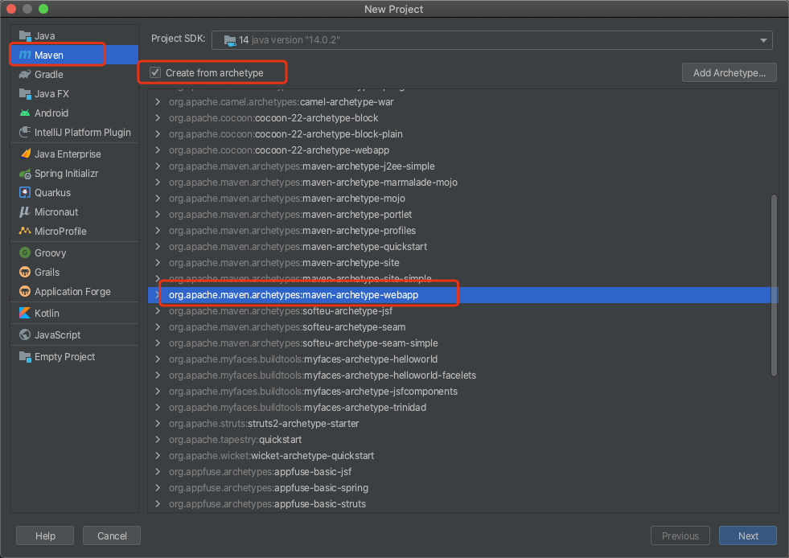

输入项目名称, 然后一路下一步, 等待 maven 运行完成

因为我想在一个文件夹下能有多个项目. 需要做以下操作.

1. 删除 src 目录

   删除后目录结构

   

2. 左键点击项目名称--> 右键单击 --> new --> module

   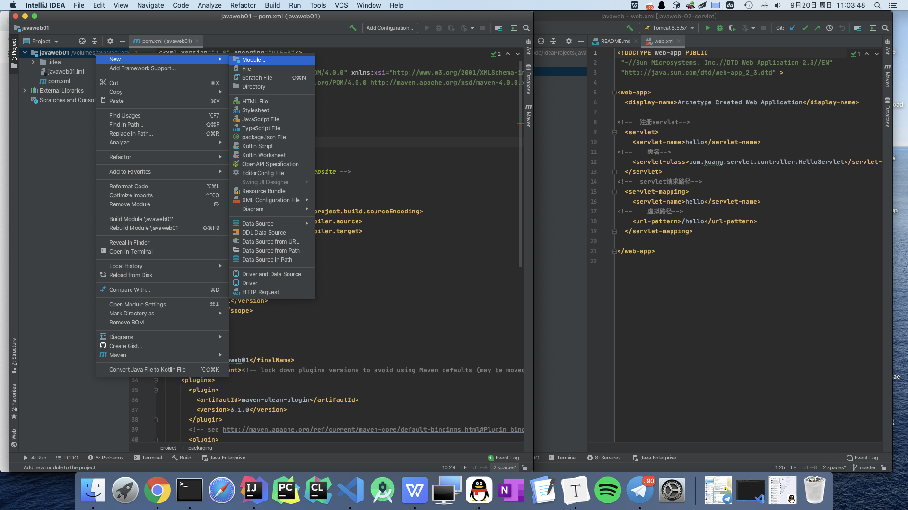

   进行和开始新建项目同样的操作


这里项目名我填入为 web01servlet, 然后一路默认下一步, 再次等待 maven 跑完

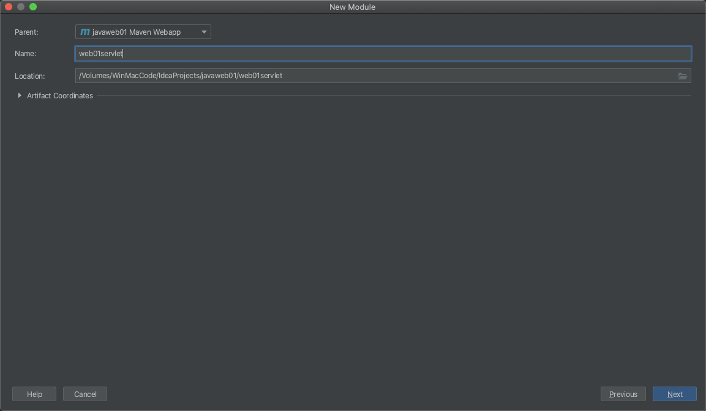

3. 添加 tomcat 服务器配置

   参考 [IDEA 集成 Tomcat ](https://blog.csdn.net/fengchao2016/article/details/83023725)

   当静态文件改变和 java 代码改变后 需要 restart server

   ~~当 java 文件改变后 需要 redeploy~~

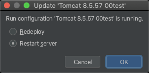

4. 在 src 下 新建 目录 java 和 resources

   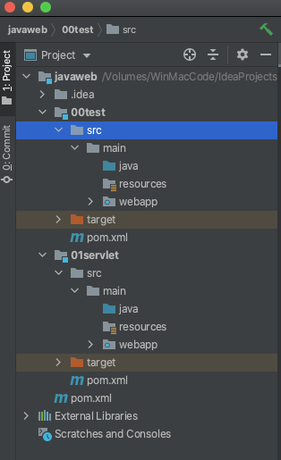

5. 在 maven 中添加 servlet 依赖.

   打开子项目里的 pom.xml 粘贴以下内容到 dependencies 下级去, 然后点击 maven 图标 下载依赖包

   ```xml
   	<dependency>
           <groupId>junit</groupId>
           <artifactId>junit</artifactId>
           <version>4.11</version>
           <scope>test</scope>
       </dependency>
       <dependency>
           <groupId>javax.servlet</groupId>
           <artifactId>javax.servlet-api</artifactId>
           <version>3.0.1</version>
           <scope>provided</scope>
       </dependency>
       <dependency>
           <groupId>javax.servlet.jsp</groupId>
           <artifactId>jsp-api</artifactId>
           <version>2.1</version>
           <scope>provided</scope>
       </dependency>
   ```

### 以下内容是用 maven 的父结构 未完成 待补充

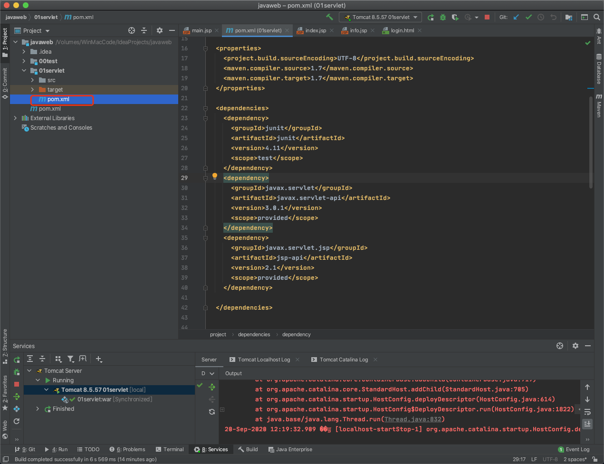


6. 上课时跟着老师敲了一部分代码. 现在跟着文档完善一下.

然后启动服务器.

---

9.21 晚上补充

### 验证码动态生成

照着老师的文档的代码敲了一遍

生成验证码的代码完成.

需要自己看的有 java 怎么绘画验证码.

有一个地方需要修改.

```java
//CreateVerifyImageController中
resp.setContentType("image/jpeg");
//老师的代码 中 img = image 基本问题也不大, 但是用谷歌浏览器打开网址, 他会当做文件来下载, 强迫症犯了..通过一个我经常用的网站看到 返回类型该改为image/jepg
```

验证码放于 session 中

在 github 找了个前端注册登录代码 改了一下 效果如下, 修改了 js 代码 点击图片刷新验证码也行了

还需要修改 css 使得验证码和输入框位于同一个行内


### 登录出错页面

[出错前端模板](https://github.com/HttpErrorPages/HttpErrorPages/tree/master/dist)

html 文件名字有大写的 tomcat 不能查看 显示 404?

后来又行了? 令人迷惑.

可能是缓存问题, 但是我也 restart server 并且 redeploy

又来了更迷惑的事情.

同一个文件夹下

HTTP500.html 不能访问

HTTP404.html 可以访问

### el 表达式不显示

需要在 jsp 文件前面加入以下代码

参考: [EL 表达式无法显示，直接显示\${xxx}](https://blog.csdn.net/lianzhang861/article/details/81232351)

```java
<%@ page isELIgnored="false" %>
```

```java
@WebServlet(value = "/controller/login.do", name = "login.do")
public class LoginController extends HttpServlet {
    @Override
    protected void doGet(HttpServletRequest req, HttpServletResponse resp) throws IOException, ServletException {
        String login_info ="test";
        req.setAttribute("login_info", login_info);
        req.getRequestDispatcher("/error.jsp").forward(req, resp);
    }
```

```java
<%@ page language="java" pageEncoding="UTF-8" %>
<%@ page isELIgnored="false" %>
<!DOCTYPE HTML>
<html>
<head>
    <meta charset="UTF-8">
    <title>JSP显示Servlet</title>
</head>
<body>
    ${login_info}
</body>
</html>
```

### 访问网址错误导致 jstl 和 el 数据不显示

正确的访问网址为

/getDownloadList.do

但是我在测试的时候直接访问的 /download.jsp 是不正确的

servlet 需要传数据给 jsp 文件, 若直接访问 jsp 文件, 没有这个过程,没数据传入,则没有显示.

只有访问 /getDownloadList.do 才能使得 jsp 文件得到数据

## 第三周课 Servlet

### MVC 模型

- Model 模型

  数据库相关 JavaBean

- View 视图

- Controller 控制器

和 Django 的 MVC 一样

Model 和数据库相关

View 响应和数据处理

### Servlet

中间层

#### servlet 方法

各种方法需要的参数以及返回值可以看源码或者教材

1. init

   首次启动调用.

2. destroy

   卸载时调用.

3. service

   顾名思义 服务是一直运行着的

   - doPost

   - doGet

#### 新建 servlet

参考 [使用 IntelliJ IDEA 新建一个 Servlet 项目](https://blog.csdn.net/chang_ge/article/details/79917956)

### 两种 URL 映射方法

参考

[Intellij idea 创建 javaWeb 以及 Servlet 简单实现](https://blog.csdn.net/yhao2014/article/details/45740111)

1. web.xml 配置文件

   ```xml
   <!--  注册HelloServlet开始-->
     <servlet>
       <servlet-name>hello</servlet-name>
   <!--    类名-->
       <servlet-class>controller.HelloServlet</servlet-class>
     </servlet>
   <!--  servlet请求路径-->
     <servlet-mapping>
       <servlet-name>hello</servlet-name>
   <!--    虚拟路径-->
       <url-pattern>/hello</url-pattern>
     </servlet-mapping>
   <!--  注册HelloServlet结束-->
   ```

2) 注解

   在 类名 上注解

   ```java
   @WebServlet(value = "/HelloServlet", name = "HelloServlet")
   public class HelloServlet extends HttpServlet {

       @Override
       protected void doGet(HttpServletRequest req, HttpServletResponse resp) throws IOException {
   //        ServletOutputStream outputStream = resp.getOutputStream();
           PrintWriter writer = resp.getWriter();//响应流
           writer.println("hello servlet changed");
       }

       @Override
       protected void doPost(HttpServletRequest req, HttpServletResponse resp) throws  IOException {
           doGet(req, resp);
       }
   }
   ```

两者选一个就行, 注解用得多些

### HttpServletRequest 对象

### **获得客户机请求头**

### 获得客户机请求参数

## 第四周课 JSP

- 前端页面网址 没有斜杠开头 后端却是以斜杠开头(web.xml 配置文件 和 类名上的注解 )

### JSP (Java Server Page)

动态页面, html 文件里嵌入 Java 代码

### 语法格式

<%@ 指令名 attribute1="value1" %>

教材 P49

和 Django 的模板语言类似

服务器可以返回 基本数据类型 对象 集合等

jstl uri 在包内没找到

解决

[配置 Jstl 的 Maven 依赖](https://blog.csdn.net/qq_29227939/article/details/52063869)

但是这个 maven 配置直接复制过来 有 Maven 依赖重复问题

使用 fo 循环

body 中

```html
<body>
  <c:forEach items="${downloadList}" var="download">
    
    <p>${download.description}</p>
  </c:forEach>
</body>
```

jsp 里最好别写代码. 多数用来数据展示。

### 流程控制

(不推荐用 JSP 做流程控制)

必须要写 Java 代码, 后期可以使用 过滤器 简化

若用到了 Java 中的 类 需要在头文件 import 该类

### 数据库

[IDEA Maven mysql 数据库操作 有 java 代码例子](https://www.cnblogs.com/dadian/p/11938707.html)

没安装数据库.

代码位于 src/main/java/DAO/UserDAO.java 中

## 第五周课 Filter

### 过滤器

访问控制, 拦截请求, 对请求重新编码和压缩响应信息等

### filter 配置

- web.xml 配置

  filter 和 filter-mapping 标记

  支持通配符

- 注解

  ```java
  @WebFilter(urlPattterns = {"@"})
  ```

  可加入初始化参数

注意: 过滤器过滤的路径不包括前端静态文件(即对 html css js 无效). 对 jsp 有效

- 过滤器使用

- 为了减少硬编码, 可以使用配置文件, 但是和注解比较起来, 较麻烦.

## 第六周课 AJAX

### JSON

1. JSON 内部包含的字符串必须要用双引号。
2. JSON 数组 JSON 对象

合格的 JSON 对象

数组 对象 以及他们的嵌套。

```json
["one", "two", "three"]
{ "one": 1, "two": 2, "three": 3 }
{"names": ["张三", "李四"] }
[ { "name": "张三"}, {"name": "李四"} ]　
```

## 作业 2 笔记：Filter 实现权限管理

### 1. web.xml 配置文件报错

```xml
<!DOCTYPE web-app PUBLIC
 "-//Sun Microsystems, Inc.//DTD Web Application 2.3//EN"
 "http://java.sun.com/dtd/web-app_2_3.dtd" >

<web-app>
  <display-name>Archetype Created Web Application</display-name>

  <!-- 定义Filter -->
  <filter>
    <!-- Filter的名字 -->
    <filter-name>permissionCheckFilter</filter-name>
    <!-- Filter的实现类 -->
    <filter-class>filter.PermissionFilter</filter-class>
    <!-- 下面3个init-param元素配置了3个参数 -->
    <init-param>
      <param-name>notCheckPath</param-name>
      <param-value>/createberifyImage.do, /login.do, /logout.do, /error.jsp</param-value>
    </init-param>
  </filter>
  <!-- 定义Filter拦截的URL地址 -->
  <filter-mapping>
    <!-- Filter的名字 -->
    <filter-name>permissionCheckFilter</filter-name>
    <!-- Filter负责拦截的URL -->
    <url-pattern>*.jsp</url-pattern>
    <url-pattern>*.do</url-pattern>
  </filter-mapping>

</web-app>
```

错误: The content of element type "filter-mapping" must match

解决:

[解决：The content of element type "web-app" must match "(icon?,display-](https://www.iteye.com/blog/jyao-1263650)

接着 测试 过滤器效果, 发现打开 login.html 404

删除了 target 文件 重新启动解决了 原因未知

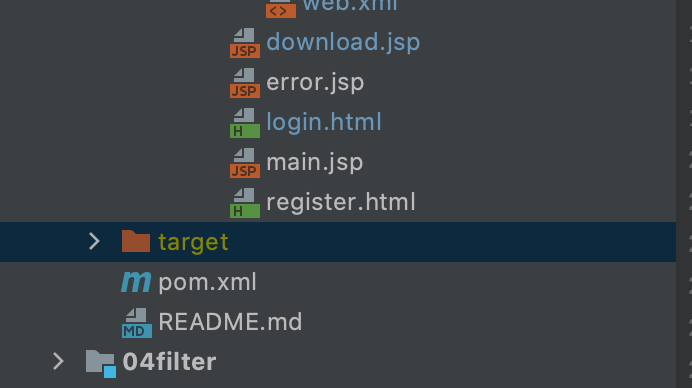

### 2. 验证码不加载

不过滤的地址配置错误 由于我自己的创建验证码的地址和老师给的参考代码不一样.

修改之后启动还是不能加载. 查看后发现前端地址有问题

后端地址注解

```
/createVerifyImage.do
```

前端

```
createVerifyImage.do
```

前端不能加 "/" 否则会变为绝对路径, 而后端却必须要加, 不然启动服务器会出错.

接着点击验证码切换新的 又不能加载.

原因: Javascript 代码没修改.

修改 js 代码后还是出错

又是前端相对路径前面不能 加 " / "

#### 总结

1. 前端相对路径开头不能有 "/", 后端路径注解必须有
2. 项目开始写代码之前, 路径这些得先确定下来, 开发过程中修改费时间还容易出问题.

### Cookie 和 Session

1. 只要注意 cookie 的 path 加上项目名就行
2. 广告的精确推送使用 cookie 以前没想到过

#### session 和 cookie 记住用户登录状态

用户登录状态在服务端记录才安全. Cookie 用于记住用户名,

是否登录( 次要, 最终还要在服务端用 session 验证一次 ).

参考:

[java 利用 Session 实现三天免登录](https://blog.csdn.net/huanyinghanlang/article/details/79061802)

主要看这: 勾选了记住我 submit 传过来得数值为 1 .

```java
String remember = req.getParameter("remember");

if (remember != null && remember.equals("1")) {// 需要记住密码
				// 将用户名和密码存放在cookie对象中
				Cookie cookie = new Cookie("userInfo", uname + ":" + pwd);
				// 设置有效时间三天
				cookie.setMaxAge(3 * 24 * 60 * 60);
				// 设置有效页面
				cookie.setPath("/uwo9/login.jsp");
				// 将cookie对象存放至response
				resp.addCookie(cookie);
```

#### 读取 cookie

需要先进行类型转换再得到 cookie

```java
HttpServletRequest request = (HttpServletRequest) req;
Cookie[] cookies = request.getCookies();
```

同理, 设置 cookie 需要

```java
HttpServletResponse  response= (HttpServletResponse) resp;
```

字符串分割取 cookie 里面的用户名和密码

参考:

[JAVA 删除 Cookie](https://blog.csdn.net/qq_39668217/article/details/87733608?utm_medium=distribute.pc_relevant_t0.none-task-blog-BlogCommendFromMachineLearnPai2-1.channel_param&depth_1-utm_source=distribute.pc_relevant_t0.none-task-blog-BlogCommendFromMachineLearnPai2-1.channel_param)

[Java split() 方法](https://www.runoob.com/java/java-string-split.html)

### 权限分配实现

- 问题

  - 后端怎么判断有没有某个权限。

    ~~每个权限分开判断？判断一次查询一次数据库？~~

    查询出所有权限，从查询结果判断有没有当前访问资源的权限。（性能低一些，但是现在这个阶段不用考虑性能问题，以后可以放在缓存中）

这个难点在于数据库的设计和下面的 sql 语句, 不过老师给了数据库设计结构. 多对多结构

查询当前登录用户所属的角色，然后查询这些角色拥有权限的资源信息, .

```sql
SELECT
	*
FROM
	t_resource
WHERE
	resourceId IN (
		SELECT
			resourceId
		FROM
			t_role_resource
		WHERE
			roleId IN (
				SELECT
					roleId
				FROM
					t_user_role
				WHERE
					userName = ?
			)
	)
```

上面这 sql 语句

先看最上面 查询结果是 t_resource 表中的所有信息。

再看 最后一句：通过用户名查询。

再看中间：通过用户名查询用户属于哪个角色。管理员还是用户等

合起来：通过用户名查询这个用户拥有权限的所有资源信息。

如果某个资源没有权限，则查询不到。

判断指定的资源（代码实现中我使用的 resourceName 判断，感觉需要改进）在不在查询结果中完成权限判断。

看了之前的代码，发现查询结果返回类写错了。原因是 sql 语句没看懂。

改好了之后，发现 List<> 用法不会，谷歌一下，之后再考虑 permittionFilter 之后怎么重定向，传什么数据，感觉好像哪里不对。突然想起 filter 是中间过程，过滤通过后需要调用 chain.dofilter。之前对 filter 的工作原理理解错误：忘了 filter 是中间过程，之前错误的将它直接当成 servlet 来使用

```java
chain.dofilter(req, resp)
```

~~并将页面重定向封装为一个方法~~

也就两三行，感觉封装没必要（或者因为我封装得太差了？）

##    第七周课 jQuery 和 JSON

### JSON

- JSON.parse(): 用于将一个 JSON 字符串转换为 JavaScript 对象

  ```javascript
  JSON.parse('{"name":"alex"}');

  JSON.parse('{name:"alex"}'); // 错误 name 需要加双引号
  ```

* JSON.stringify(): 用于将 JavaScript 值转换为 JSON 字符串。

  ```javascript
  var jsonStr = JSON.stringify({ name: "alex" });
  ```

### jQuery

#### 属性获取

表单：val

其他：html text

#### css 选择器

用的 css 选择器较多

#### 属性选择器

#### 基本过滤选择器

:first

:last

:even

:odd

#### 方法

ajax 方法例子

```javascript
$("#b1").click(function() {
  var data = {
    username: $("#username").val(),
    password: $("#password").val(),
  };

  $.ajax({
    url: "login.do",
    type: "POST",
    data: data,
    dataType: "JSON",
    success: function(data) {
      alert(data);
    },
    error: function(data) {
      alert(" internet error");
    },
  });
});
```

#### 查询例子

组合查询 某些支持模糊查询

## 作业 3 笔记 Ajax 登录注册

~~登录用原生 Javascript 和 XMLHttpRequest 完成~~

登录注册都用 jQuery 和 Ajax 完成，原生 Javascript 太难用了。

### 第一步 修改 Javascript 代码

1. 首先参考老师的代码将 Javascript 代码修改成了函数调用的。

2. 需要写后端返回 JSON 数据的接口。

   参考：[[JavaWeb 返回 json 数据的两种方式](https://my.oschina.net/u/4287266/blog/3891785)](https://my.oschina.net/u/4287266/blog/3891785)

   文章中提到的第一种方法 找不到 JSONObject，所以用第二种。

   ```java
   login_info = "登录成功";
   resp.setContentType("application/json;charset=utf-8;");
   String result = " {\"code\": 0,\"info\": \"" + login_info + "\"}";
   resp.getWriter().print(result);
   ```

   需要用转义字符 \ 转义 引号。

   ```json
   String result = " {\"code\": 1,\"info\": \"" + login_info + "\"}";
   ```

   改好后，先测试第一个，出错。需要修改过滤器配置文件。

   将 ajaxLoginCheck.do 加入不需要访问权限的。还是 404 .

   发现是前端传过来的参数不对。后端需要的是 userName， 我传来的是 email，修改又有 500 （服务器内部错误）问题。数据库连接出了问题（我根本没开数据库），后面找个空闲时间再安排好数据库。

把查询数据库的操作改为了自己手动新建一个 User 对象，然后测试，

一直出现验证码错误。。原来又是前端传的 验证码 变量名称和后端的不一样。

终于改好了

谨记：前后端传的参数一定要协商好，前后端传送的参数不要随便修改，不然后期测试容易懵逼而且替换起来真的难受。


### ajax 登录

Gson maven 依赖

```xml
<!-- https://mvnrepository.com/artifact/com.google.code.gson/gson -->
<dependency>
    <groupId>com.google.code.gson</groupId>
    <artifactId>gson</artifactId>
    <version>2.8.6</version>
</dependency>
```

---

```Java
Map<String, Object> map = new HashMap<String, Object>();

if (判断逻辑){
  map.put("code", 1或0);
  map.put("info", "提示信息");
}
else ...

String jsonStr = new Gson().toJson(map);
resp.setContentType("text/json;charset=uft-8");
PrintWriter out = resp.getWriter();
out.print(jsonStr);
out.flush();
out.close();
```

## 项目开发流程介绍

1. 需求分析

2. 设计

   - 前端

     - 布局

       - html div container span

         - 表格

           - thead 标题

             不用 tr 方便选择

           - tfoot 页脚

             同上

         - 浮动

           左右浮动

       - 任何元素都能做按钮，通过 css 设置美化

     - 样式

       - 渐变色
       - bootstrap
       - 阿里巴巴图标素材 alifont

     - 框架

       - bootstrap
       - vue 的 elementUI

   - 后端

     - Controller DAO

   - 交互

     - 人机交互

     - 交互数据的封装

       前端请求后端数据返回的接口设计

       - page 分页查询参数

         ? 开头的查询参数

         JSON 数据需要用输入输出流才能接收

       - 服务器返回

         - 记录条数 当前为第几页

           总之：就是看前端要什么数据，后端返回什么数据。

3. 实现

   注重设计，设计好了写代码就是简单的事情了。

4. 测试

5. 部署

6. 维护

7. 持续集成

## 第八周课

### CRUD

CRUD是指在做计算处理时的增加(Create)、读取查询(Retrieve)、更新(Update)和删除(Delete)几个单词的首字母简写。

### 弹出层实现：设置背景透明度。

- 两个 div
  - 背景 div
  
  - 内容 div
  
    

a 标签做按钮，设置它的css。

css：

- 块元素 block ：从上往下放置

  div form 

- 行内元素 inline ：从左往右放置

  a img input span 

- inline-block：

  display 属性可以改变属性。

### 交互设计

$(选择器).事件(函数)；

选择器选择某个元素，当此元素发生时间后，执行函数。

$(document).ready( function() ); 

网页加载完成执行函数

> 1. 静态元素事件绑定

常用 css 选择器

- id
- class
- ...


> 2. 动态元素事件绑定

~~当你 操作 某个元素时，jQuery 给此元素的父元素添加属性？~~

这个需要好好理解下

```javascript
//①　动态产生的tbody下的tr鼠标移上，离开事件
$("tbody").on("mouseover", "tr", function() {
        $(this).addClass('tr_hover'); //通过jQuery控制实现鼠标悬停上的背景色
 });
 $("tbody").on("mouseout", "tr", function() {
        $(this).removeClass('tr_hover'); //通过jQuery控制实现鼠标悬停上的背景色
 });
//②　动态产生的tbody下的tr里面的input点击事件
$("tbody").on("click", "tr input:checkbox", function() {
        if (this.checked == true) {
            $(this).parents("tr").addClass('tr_select');
        } else {
            $(this).parents("tr").removeClass('tr_select');
        }
 });
//③　动态产生的table下的删除修改按钮点击事件
$('table').on('click', '#btnDel',  事件处理函数);
$('table').on('click', '#btnEdit',  事件处理函数);
注意：元素的事件绑定一般写在document的ready事件中，只有当在元素相应事件发生后才会执行。
```

对于 1 ：

​	当鼠标点在 tbody 标签上时，tbody 下的 tr 标签增加一个 class 属性，属性值为 tr_hover。浏览器会将 tr_hover 的样式应用到 tbody 下的 tr 标签上，即当前鼠标停留的位置。

对于2 和 3 差不多。

- 需要重用或者行数很多的 JavaScript 代码写成一个函数。

### 数据库

#### 查询

##### 多表连接查询

一对多、多对多都是用到。

join 关键字。

- 表的别名 = 表的前缀

- 表的链接

  - 左连接 left-join

    以左表为准，左表有的全显示

  - inner：

    左表无匹配的不显示？

- 条件查询

  - WHERE 

  - LIKE

    模糊查询

- 其他 SQL 参数

  - order by

    - desc
    - asc

  - limit

    分页查询

  - in
    
    - 批量操作、或操作

- SQL 注入安全问题

  - 尽量不用 SQL 语句字符串拼接。

### 问题

- 怎样将重复性的代码合并或者怎么设计。
  - 比如 DAO 查询语句，多个参数查询。
    - if 语句判断某个参数是否为 null 或 ” “，空格
- 数据库语句不熟，只会简单的语句。

## 作业 4：[ 基于 AJAX 的 CRUD ](https://www.trustie.net/student_work?homework=12108)

- ~~这次作业把数据库用上。前端页面也要完成 主要是 css。~~

  有空再搞

- ~~先写后端再写前端~~，数据库用 docker

  我还是先写了前端

- 写代码之前把思路理清，事半功倍。

### 难点

1. CSS JavaScript， CSS 可以暂时不写
2. 后端数据库查询语句，不定参数 if 语句

### 前端

#### 前端页面设计

- 尽量不出现滚动条

  css

- 表格导航栏固定 

  css

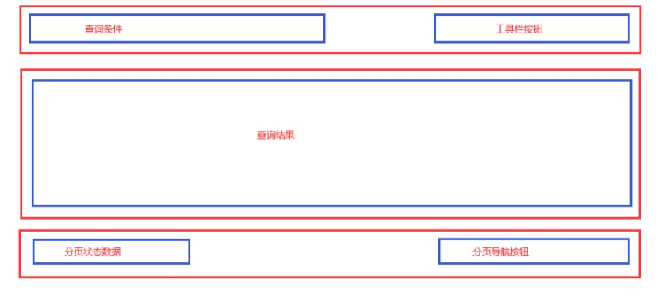

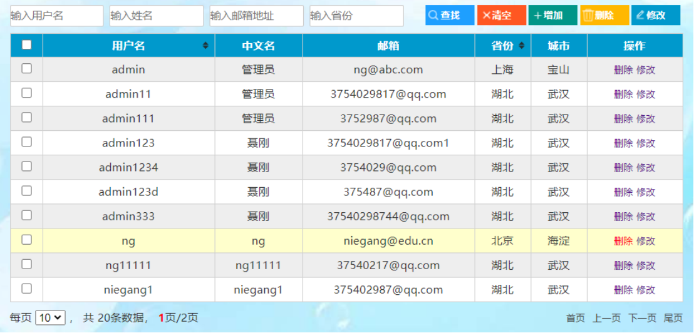


#### 界面 css

设置块元素居中

[CSS居中完整指南](https://www.w3cplus.com/css/centering-css-complete-guide.html)

[表格合并](https://www.w3school.com.cn/tiy/t.asp?f=html_table_span)

##### 基本布局

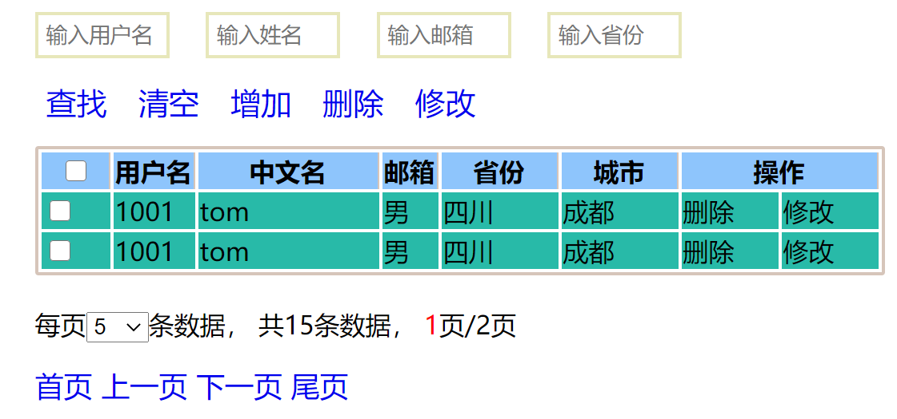

勉强能看。差的东西是 **定位** 和颜色方面的。

##### hover 和 选中

```css
/* 表格中鼠标悬停行的颜色*/
.tr_hover{
    background-color: #5dae78;
}

/* 表格中选中元素的颜色 */
.tr_selected{
    background-color: #2b7e66;
}
```


---

```javascript
// 鼠标悬停改变背景色
$("tbody")
  .on("mouseover","tr",function(){
  $(this).addClass('tr_hover');
})
  .on("mouseout","tr",function(){
  $(this).removeClass('tr_hover');
});

// checkbox 表格中被选中行颜色改变
$("tbody td input:checkbox").click(
  function (){
    if (this.checked === true){
      $(this).parents("tr").addClass("tr_selected");
    }
    else {
      $(this).parents("tr").removeClass("tr_selected");
    }
  }
);
```

JavaScript 链式编程，可以这样写，一个选择器只写一次，可以多添加几个事件，选择器多次使用 IDEA 会 warning。

##### 隔行变色

```javascript
// 单双行颜色循环变化
$("tbody tr:even").addClass("tr_even");
$("tbody tr:odd").addClass("tr_odd");
```


----

```css
.tr_even{
    background-color: #a4dbe2;
}

.tr_odd{
    background-color: #f1eaea;
}
```

css 文件中从上到下，靠后的属性会覆盖前面的，所有 .tr_even 和 .tr_odd 放在 .tr_hover 和 .tr_selected 前面。注意颜色区分要明显一点。

##### 动态元素事件和静态元素事件区别

暂时未知


##### 全选按钮

[【jQuery】复选框的批量处理：全选、非全选](https://blog.csdn.net/LZGS_4/article/details/47075351)

<font color=yellow>注意：元素的事件绑定一般写在 document 的 ready 事件中，只有当在元素相应事件发生后才会执行</font>

```javascript

```

---

```css

```

#####  导航按钮等

[jQuery 绑定 select 标签的onchange事件](https://blog.csdn.net/zzq900503/article/details/45023817)

##### 工具栏按钮

##### table 按钮操作

```javascript
$('table').on('click', '#btnDel',  事件处理函数);
```

这个方法怎么用？貌似这个事件处理函数不能调用外部函数吗？还是参数没给对。

事件处理函数不能加括号

```javascript
$('table')
  .on('click','.btnDel', tdDel)
// 表格中的修改按钮事件
  .on('click','.btnEdit',tdEdit);
```

[Location.reload()](https://developer.mozilla.org/zh-CN/docs/Web/API/Location/reload)

```javascript
// 重新加载页面，不使用缓存
window.location.reload(true);
```

获取多个 checkbox中的 value 属性出错，拼接后的结果全是 username01，命名选择了 username02

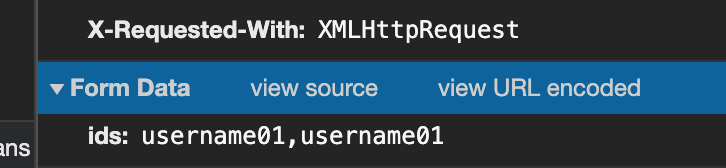

解决

```javascript
else {
  // 定义数组
  let vals = [];
  checkedItems.each(function (index, item) {
    // 循环将选择复选框的 value 值加入数组中
    // 要用 this 才行 用 checkedItems 每次都是 push 第一个元素
    // 错误写法
    // console.log(checkedItems.val());
    console.log($(this).val());
    vals.push($(this).val());
  });
```


[ jQuery on 事件](https://api.jquery.com/on/)

[jQuery on() 方法](https://www.runoob.com/jquery/event-on.html)

### JavaScript this 关键字


#### 查询

##### 组合查询

- ~~最初打开时，点击查询按钮不带筛选条件（ 像极了学校的选课系统 ）~~，onload 事件后 ajax 请求得到，显示在 tbody 中，不需要用户主动查询，

- 从左上角输入框获取查询数据，通过 URL 参数发送给后端，参数数量不定，查找按钮绑定事件，返回的数据加到 tbody 中显示

- 模糊查询

  后端 SELECT LIKE 限定词

##### 分页查询

点击 上/下 一页 时查询，URL 参数为 页码数和每页显示数据 的结合，需要计算一下，剩下的工作后端 SQL 语句做，返回数据显示到 tbody 中

> 客户端请求
>
> n 请求数据：查询条件，分页参数（每页大小，访问的页码，排序字段，排序方式）
>
> n 数据格式：application/x-www-form-urlencoded，设置两个key，值为json字符串
>
> n 示例：
>
> queryParams: 
>
> {"userName":"admin","chrName":"聂","mail":"qq.com","provinceName":"湖北"}
>
> pageParams: 
>
> {"pageSize":"10","pageNumber":"1","sort":"userName","sortOrder":"desc"}

暴露出了我自己设计各个操作时，实现复杂。


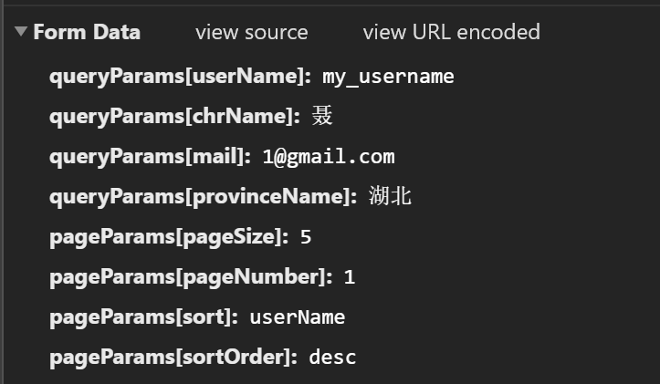

老师给的 JSON 字符串 差了一个逗号。pageNumber 要用 .text() 获取，其他几个用 .val

[jQuery 修改标签属性](https://blog.csdn.net/q5706503/article/details/83041426?utm_medium=distribute.pc_relevant.none-task-blog-BlogCommendFromMachineLearnPai2-3.channel_param&depth_1-utm_source=distribute.pc_relevant.none-task-blog-BlogCommendFromMachineLearnPai2-3.channel_param)

#### 排序输出

查询后的结果再排序，JavaScript 代码排序实现，参数为 排序方式 应该是 boolean 类型，只有两种选项，需要一个变量记录当前值为 true 或 false，两者点击即可互换。

#### 结果显示

无，由其他需求完成

#### 隔行换色

jQuery 的 add odd 属性实现。具体谷歌 忘了。

#### 高亮显示

css hover

#### 批量选择

- 第一行按钮的点击事件

  - 选中高亮显示怎么操作？

    将选中的行用 jQuery 动态增加 class 属性，此 class 属性的 css 颜色设置为与没选中的不同，jQuery + css 完成

#### 删除

> 删除时只需将待删除记录的关键字段值传递给服务器即可，如果是删除多条记录，可以把多条记录的id拼接成一个字符串，之间以逗号分隔。
>
> 如：
>
> ids=admin,ng
>
> Ids=admin
>
> 批量删除时还需判断表格中复选框是否至少选中一项，循环读取所有选中的复选框，得到value值，拼接成一个字符串作为参数发送给服务器。
>
> 服务器处理完毕后，返回一个简单的操作结果即可。如
>
> {“code”:”0”,”info”:”删除成功”}
>
> {“code”:”1”,”info”:”删除失败”}

##### 单一删除

根据此条数据的 id 删除，post 方法（  安全些？）

##### 批量删除

组成一个 list ？

#### 修改

> 修改和增加功能基本类似，前端使用相同的表单，后端使用相同的控制器，为表示区别，在表单中增加一个隐藏项，
>
> <input id="action" name="action" type="text" hidden />
>
> 增加时赋值”insert”，修改时赋值”update”，控制器读取action参数，分别调用dao对应的方法进行操作。
>
> 点击增加按钮时表单所有输入项初始为空白，点击修改按钮时需要将当前行记录回填到表单对应输入项中，同时将关键字段设置为只读。

##### 单一修改

- 窗口弹出修改界面

  老师给的文档里有实现方法
  
  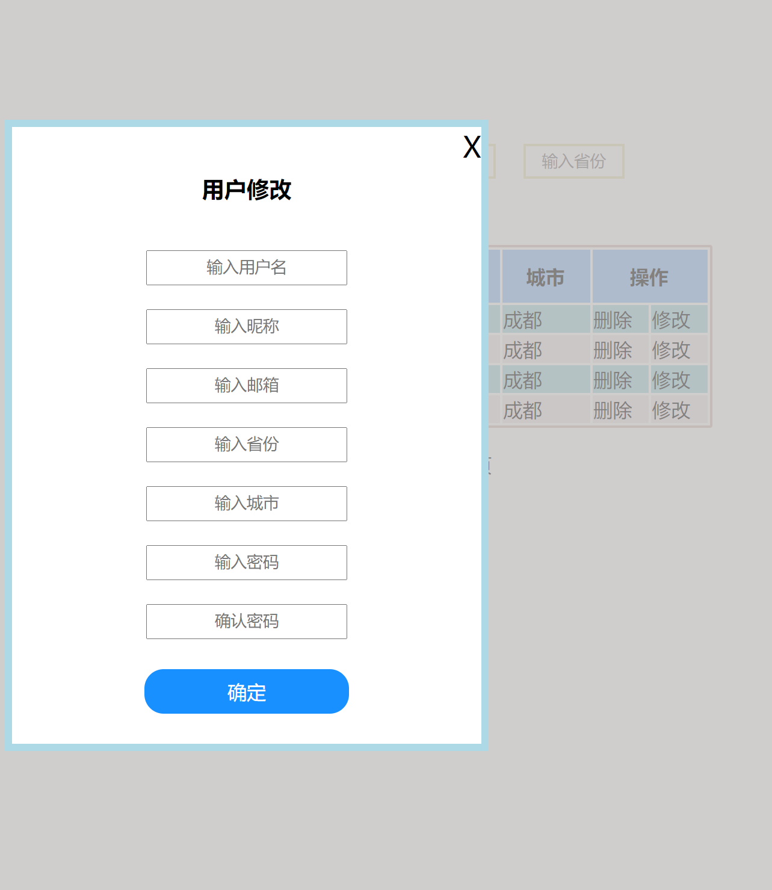
  
  并没有居中，推测是 jQuery 中设置的 css 属性没有生效。一直没解决。后来设置 css 完成
  
  ```css
  .white_content{
      display: none;
      position: absolute;
      width: 390px;
      left: 20%; // 设置的这两个
      top: 15%;
      border: 6px solid lightblue;
      border-radius: 1em;
      background-color: white;
      z-index: 1002;
      overflow: auto;
  }
  ```
  
  

##### 批量修改

弹出选项框

- 选择需要修改的属性，确认，提交，后端批量修改，弹出框点击事件提交数据。

#### 增加

和修改类似，后端处理增加和修改也用同一个类，用 if 判断执行相应的操作。

#### 分页


### 后端

#### 修改为真正的 DAO 设计模式

之前的代码没有真正实现 DAO 设计模式

修改了数据库相关的代码

IUserDAO：接口，定义对 User 类的操作，不实现方法。

UserDAOImpl：实现 IUserDAO 接口，包含 SQL 语句以及对查询结果处理返回方法需要的值，不包含数据库连接

CheckUserExistController：代码中用到了数据库。

 1. 建立数据库连接类

 2. 从 DAOFactory 中 getIUserDAOInstance，需要传入连接类对象

 3. 使用 getIUserDAOInstance 实例对象里的方法

 4. 关闭数据库连接对象

    在查询数据库的前一行（不是新建连接类的时候） 用 try 包围 数据库查询语句，查询语句后一行用 catch，最后 finally 关闭链接对象

    实际操作用到的代码

    ```java
    // 1 建立数据库连接类
    Connection con = new DatabaseConnection().getConnection();
    // 2 从 DAOFactory 中 getIUserDAOInstance，需要传入连接类对象
    IUserDAO iUserDAOInstance = DAOFactory.getIUserDAOInstance(con);
    
    try{
        // 3 使用 getIUserDAOInstance 实例对象里的方法
    	boolean isExist = iUserDAOInstance.checkUserExistByUserName(userName);
        // 业务逻辑操作
    }catch (SQLException throwables) {
        throwables.printStackTrace();
    }finally {
        // 4 controller 关闭数据库连接对象，不管是否异常都要关闭
        try {
            con.close();
        } catch (SQLException throwables) {
            throwables.printStackTrace();
        }
    }
    ```

- IUserDAO

  ```java
  
  
  package dao;
  
  import vo.User;
  
  import java.sql.SQLException;
  
  public interface IUserDAO {
      /**
       * 通过用户名查询用户信息
       * @param userName 用户名
       * @return User类
       */
      User getByUserName(String userName) throws SQLException;
  
  
      boolean insert(User user) throws Exception;
  
      /** 查看用户名是否已经被使用
       * @param userName 用户名
       * @return true：  用户名已被注册 或 查询过程出错
       *         false： 用户名未被注册
       *
       */
      boolean checkUserExistByUserName(String userName) throws SQLException;
  
      /** 查看 email 是否已经被使用
       * @param email    邮箱
       * @return true：  邮箱已被注册 或 查询过程出错
       *         false： 邮箱未被注册
       *
       */
      boolean checkUserExistByEmail(String email) throws SQLException;
  
  }
  
  ```

- UserDAOImpl

  ```java
  package dao.impl;
  
  import dao.IUserDAO;
  import vo.User;
  
  import java.sql.*;
  
  public class UserDAOImpl implements IUserDAO {
  
      private Connection conn;
      private PreparedStatement pstmt;
  
      // 实例化时，给该类提供连接对象
      public UserDAOImpl(Connection conn) {
          this.conn = conn;
      }
  
      /**
       * 通过用户名查询用户信息
       * @param userName 用户名
       * @return User类
       */
      @Override
      public User getByUserName(String userName) throws SQLException {
          String sql="select * from t_user where username=?";
          this.pstmt=this.conn.prepareStatement(sql);
          this.pstmt.setString(1, userName);
  
          User user = new User();
          ResultSet rs = this.pstmt.executeQuery();
          if (rs.next()) {
              user.setUserName(rs.getString("userName"));
              user.setRealName(rs.getString("realName"));
              user.setEmail(rs.getString("email"));
              user.setProvince(rs.getString("province"));
              user.setCity(rs.getString("city"));
              user.setPassword(rs.getString("password"));
              user.setChrName(rs.getString("chrName"));
              user.setRole(rs.getString("role"));
          }
          else {
              user = null;
          }
          return user;
      }
  
  
      @Override
      public boolean insert(User user) throws Exception{
          //获取数据库连接
          String sql="" +
                  "INSERT INTO t_user (userName, realName, email, province,city,password,chrName, role)" +
                  "VALUES (?,?,?,?,?,?,?,?);";
          this.pstmt=this.conn.prepareStatement(sql);
          this.pstmt.setString(1, user.getUserName());
          this.pstmt.setString(2, user.getRealName());
          this.pstmt.setString(3, user.getEmail());
          this.pstmt.setString(4, user.getProvince());
          this.pstmt.setString(5, user.getCity());
          this.pstmt.setString(6, user.getPassword());
          this.pstmt.setString(7, user.getChrName());
          this.pstmt.setString(8, user.getRole());
  
          if (this.pstmt.executeUpdate() > 0) {
              return true;
          }
          else {
              return false;
          }
      }
  
      /** 查看用户名是否已经被使用
       * @param userName 用户名
       * @return true：  用户名已被注册 或 查询过程出错
       *         false： 用户名未被注册
       *
       */
      @Override
      public  boolean checkUserExistByUserName(String userName) throws SQLException {
          //获取数据库连接
          String sql="select * from t_user where username=?";
          this.pstmt=this.conn.prepareStatement(sql);
          this.pstmt.setString(1, userName);
          if (this.pstmt.executeUpdate() > 0) {
              return true;
          }
          else {
              return false;
          }
      }
  
      /** 查看 email 是否已经被使用
       * @param email    邮箱
       * @return true：  邮箱已被注册 或 查询过程出错
       *         false： 邮箱未被注册
       *
       */
      @Override
      public  boolean checkUserExistByEmail(String email) throws SQLException {
  
          String sql="select * from t_user where email=?";
          this.pstmt = this.conn.prepareStatement(sql);
          this.pstmt.setString(1, email);
  
          if (this.pstmt.executeUpdate() > 0) {
              return true;
          }
          else {
              return false;
          }
      }
  }
  
  ```

- CheckUserExistController

  ```java
  package controller;
  
  import com.google.gson.Gson;
  import dao.IUserDAO;
  import dao.impl.UserDAOImpl;
  import dbc.DatabaseConnection;
  import factory.DAOFactory;
  
  import javax.servlet.ServletException;
  import javax.servlet.annotation.WebServlet;
  import javax.servlet.http.HttpServlet;
  import javax.servlet.http.HttpServletRequest;
  import javax.servlet.http.HttpServletResponse;
  import java.io.IOException;
  import java.sql.Connection;
  import java.sql.SQLException;
  import java.util.HashMap;
  import java.util.Map;
  
  /**
   * 检测用户名或邮箱是否已经被注册
   */
  @WebServlet("checkExist.do")
  public class CheckUserExistController extends HttpServlet {
      protected void doPost(HttpServletRequest request, HttpServletResponse response) throws ServletException, IOException {
          //1. 字符编码
          request.setCharacterEncoding("utf-8");
          //2.接受请求数据
          String userName = request.getParameter("userName");
          String email = request.getParameter("email");
          Map<String, Object> map = new HashMap<String, Object>();
          // 数据库连接对象
          Connection con = new DatabaseConnection().getConnection();
          // 用户名参数存在 说明是想验证用户名是否存在
          if ( !(userName == null) ){
              IUserDAO iUserDAOInstance = DAOFactory.getIUserDAOInstance(con);
              boolean isExist = false;
              try {
                  isExist = iUserDAOInstance.checkUserExistByUserName(userName);
              } catch (SQLException throwables) {
                  throwables.printStackTrace();
              }
              finally {
                  try {
                      con.close();
                  } catch (SQLException throwables) {
                      throwables.printStackTrace();
                  }
              }
              // username 存在返回 1
              if (isExist) {
                  map.put("code", 1);
              }
              // username 不存在返回 0
              else {
                  map.put("code", 0);
              }
          }
          // email 参数存在 说明是想验证 email 是否存在
          if (!(email == null)){
              IUserDAO iUserDAOInstance = DAOFactory.getIUserDAOInstance(con);
              boolean isExist = false;
              try {
                  isExist = iUserDAOInstance.checkUserExistByEmail(userName);
              } catch (SQLException throwables) {
                  throwables.printStackTrace();
              }
              // email 存在返回 1
              if (isExist) {
                  map.put("code", 1);
              }
              // email 不存在返回 0
              else {
                  map.put("code", 0);
              }
          }
          // 响应流
          String jsonStr = new Gson().toJson(map);
          response.setContentType("text/json;charset=uft-8");
          response.getWriter().print(jsonStr);
      }
  
      protected void doGet(HttpServletRequest request, HttpServletResponse response) throws ServletException, IOException {
  
      }
  }
  
  ```

  

#### Controller


#### DAO

## 第九周课：Vue 入门

### 理念

html css JavaScript 是基础

框架只是工具，现在的框架入门挺容易，学习成本不高。不应花太多时间在学习上面。应该是入门之后，查看文档现学现用来实现你想要的功能。多思考，自信点

### Vue 参考

[Vue API](https://cn.vuejs.org/v2/api/)

[Vue 教程](https://cn.vuejs.org/v2/guide/)

Vue + jQuery Ajax 实现

先写代码框架，例如先建立类，方法，方法参数，返回类型，注释，流程控制框架，框架搭建好后再写具体的代码，这样层次清晰，也不容易出错，由具体到细节。

```javascript
var _self = this; // 解决冲突，jQuery 和 Vue 中的 this 关键字会冲突 
```

### 前端常见框架

- <font color=red>jQuery</font>

- 其他 jQuery 插件

  - 日期选择
  - 图片轮播
  - 树状菜单 zTree
  - 表单校验

- jQuery easyUI

  基于 jQuery + css

- <font color=red>Bootstrap</font>

  将常见样式封装，通过类选择器设置属性，自适应电脑和手机。

- Vue

- Angular.js

- Node.js

- EChart

  数据可视化，各种图标。只需要提供指定格式的数据。框架提供了模板，提供数据填充即可。

- HightChart

  同上

### API

- 本地函数也称为 API

  如 Java 中的库函数，所有就有 Java API 这个说法

- 现在的 API 多指服务器提供的数据接口

  - 字符流 key:value，网址上传送的查询参数 ?key1=value1&key2=value2

  - 服务器返回 JSON 字符串

    返回对象和数组

### 云

Paas

lass

Saas

### 怎样根据官方文档学习

1. 查看示例
2. 快速入门
3. 具体使用时查询文档 

## 作业5：用 Vue 完成作业 4 中的前端页面

### 参考

[API — Vue.js](https://cn.vuejs.org/v2/api/)

[介绍 — Vue.js](https://cn.vuejs.org/v2/guide/)

[Vue.js Ajax(axios) | 菜鸟教程](https://www.runoob.com/vue2/vuejs-ajax-axios.html)

[web应用开发教案.docx](https://github.com/DayoWong0/javaweb/doc/web应用开发教案.docx)

### 实现

Ajax 请求 使用 axios （Vue 官方推荐的 Ajax 请求库）

css 先保持不变

1. 将整个页面分为几个模块并给上 id，绑定 Vue 实例，写好 method（参考之前的 JS 文件），data，ajax 请求总体框架。

   1. 整个页面就一个 Vue 实例还是需要多个？

      多个

2. 加上对应的 vue 指令

3. 完成 1 中写好的框架

4. 对照作业 4 看是否有功能遗漏

## 第十周课 SpringMVC

[IntelliJ IDEA 创建Spring+SpringMVC+mybatis+maven项目](https://juejin.im/post/6844903856883630093)

[Spring | Home](https://spring.io/)

### SpringMVC入门

