# MySQL

参考资料: 

[【狂神说Java】MySQL最新教程通俗易懂](https://www.bilibili.com/video/BV1NJ411J79W)

## 数据库分类

- 关系型数据库 (SQL)

  MySQL SQLlite

- 非关系型数据库(NoSQL) Not only SQL

  对象存储

  Redis, MongDB

## MySQL Docker配置

- MySQL版本: 5.7.19

- 首次运行

  端口: 3306

  root密码: 123456

  ```shell
  docker run -itd --name mysql-test -p 3306:3306 -e MYSQL_ROOT_PASSWORD=123456 mysql:5.7.19
  ```

- 启动

  ```shell
  docker start 实例id
  ```

- 停止

  ```shell
  docker stop 实例id
  ```

- 进入MySQL命令行

  ```shell
  docker exec -it 实例id mysql -u root -p
  ```

##  MySQL命令

``` shell
show databases; 	--查看所有数据库
```

```shell
use school; --切换到 school数据库
```

```shell
describe student; --查看表的信息
```

```shell
creat database school; --创建数据库school
```

```shell
exit;--退出 
```

- if语句

  如果不存在数据库school则创建数据库school

```sql
CREATE DATABASE IF NOT EXISTS school;
```

- 如果表名或者字段名为SQL保留字, 用反单引号Tab键上面那个引起来

  ```sql
  USE `user`;
  ```

- 从已经建好的表中获取新建表的命令

  可以先用软件手动建好表, 再导出

  ```SQL
  SHOW CREATE DATABASE 数据库名字
  ```

  ```sql
  	SHOW CREATE TABLE 数据表名称
  ```

  - 例子

  ```sql
  CREATE DATABASE `school` /*!40100 DEFAULT CHARACTER SET utf8 */
  ```

  - ```sql
    student	CREATE TABLE `student` (↵  `id` int(11) unsigned NOT NULL AUTO_INCREMENT COMMENT '学员id',↵  `name` varchar(100) NOT NULL DEFAULT '' COMMENT '姓名',↵  `age` int(3) NOT NULL COMMENT '年龄',↵  PRIMARY KEY (`id`)↵) ENGINE=InnoDB AUTO_INCREMENT=3 DEFAULT CHARSET=utf8
    ```

- DESC  表名: 显示表的结构.
- 修改表名
- 增加表的字段
- 修改表的字段

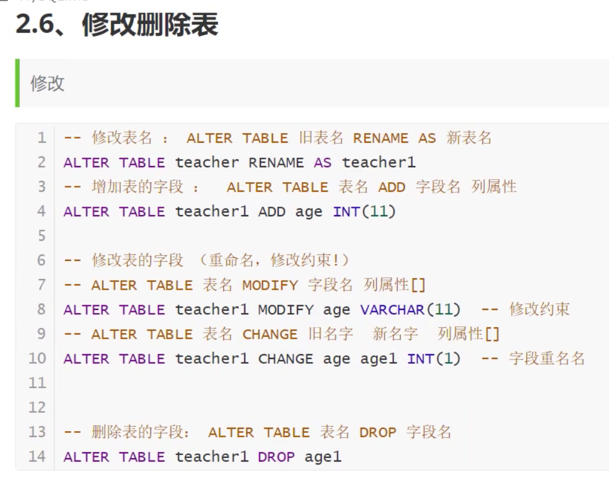

- 删除

  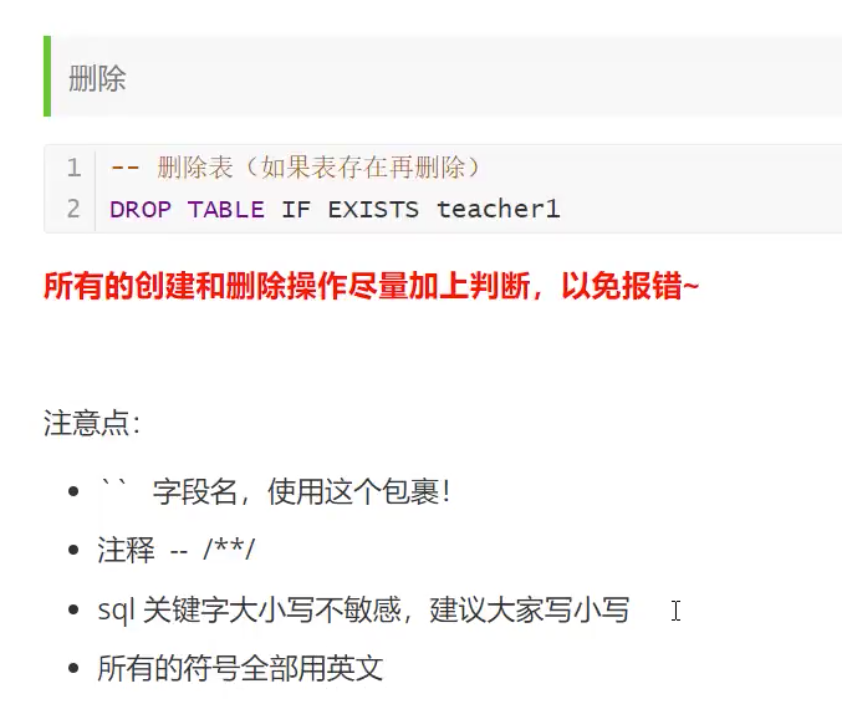

  


## 数据类型

- 数值

  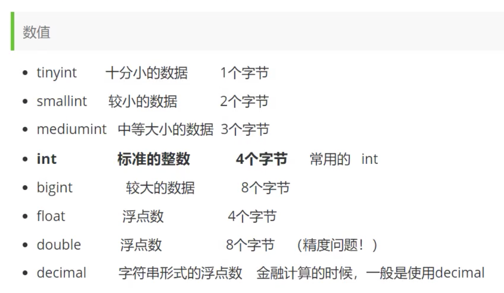

- 字符串

  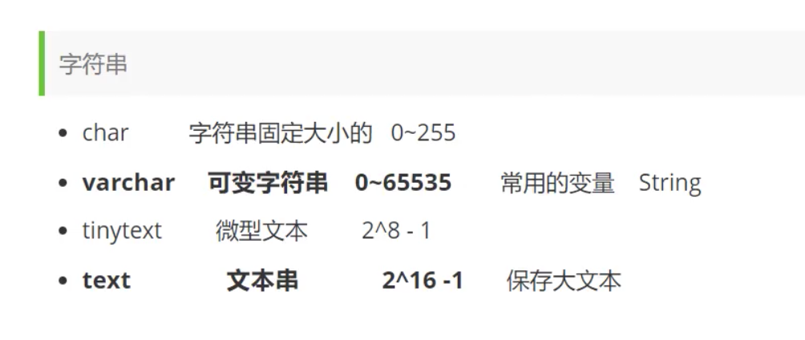

- 时间日期

  

- null

  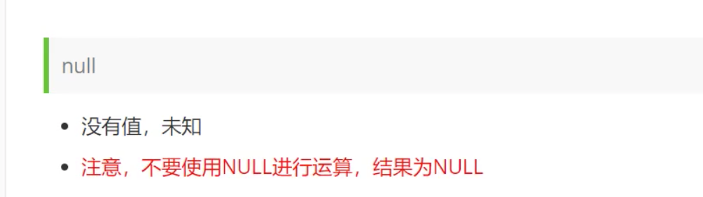

## 数据库字段属性(重要)

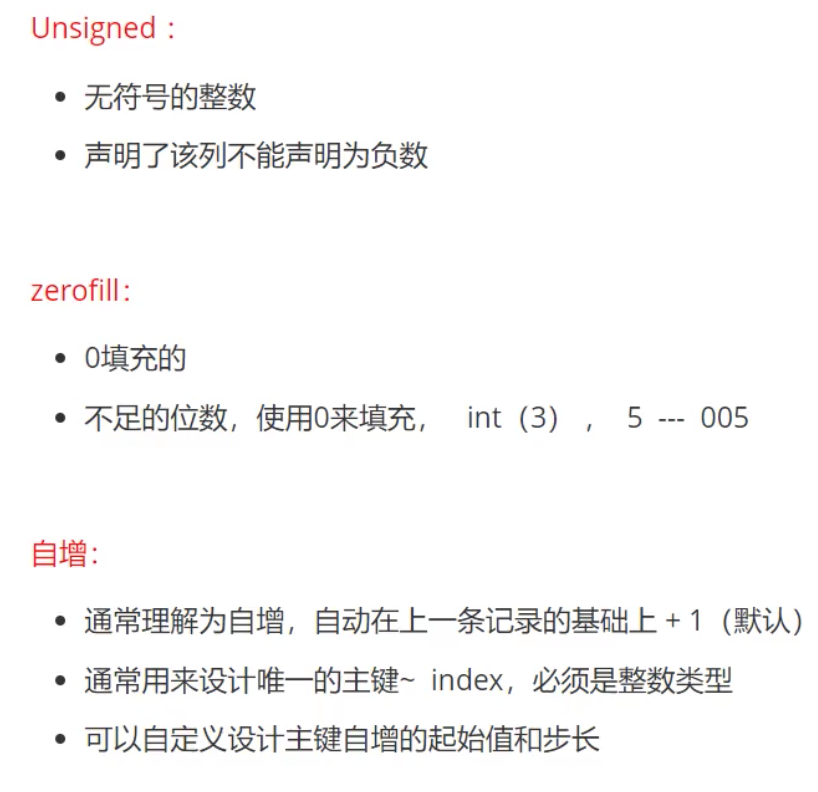

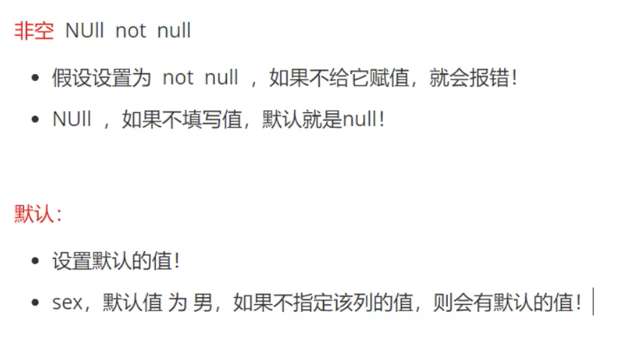

拓展: 

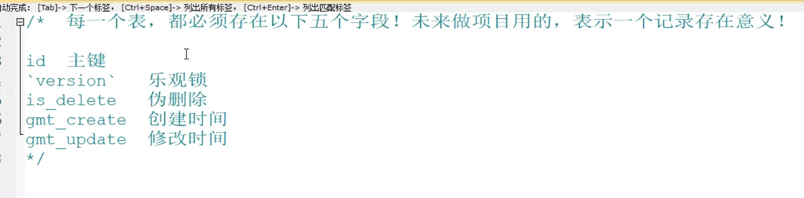

## 数据表的类型

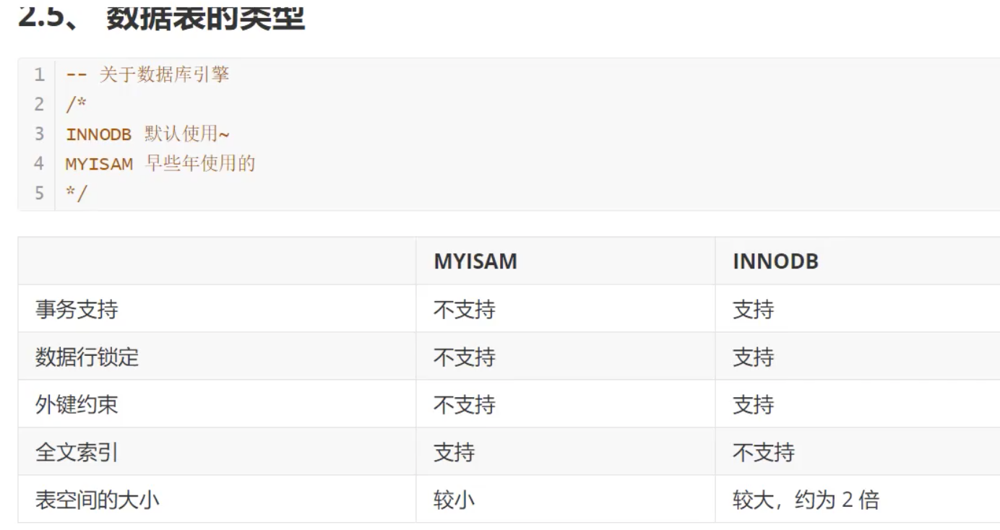


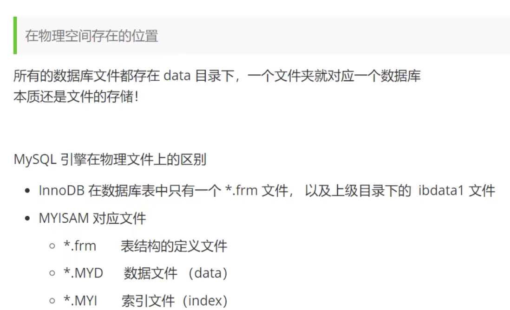

### 字符集编码

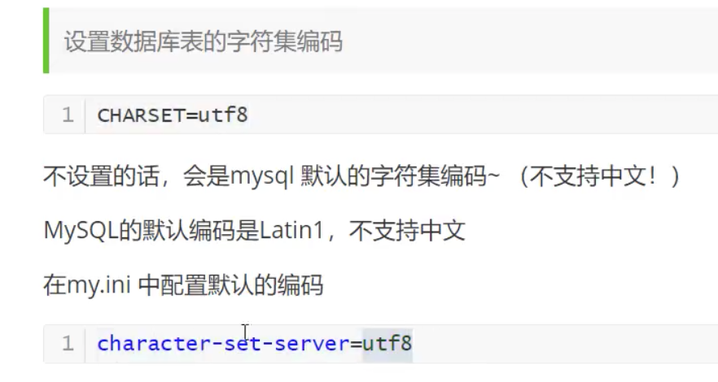

## 3. MySQL数据管理

### 3.1 外键(了解即可)

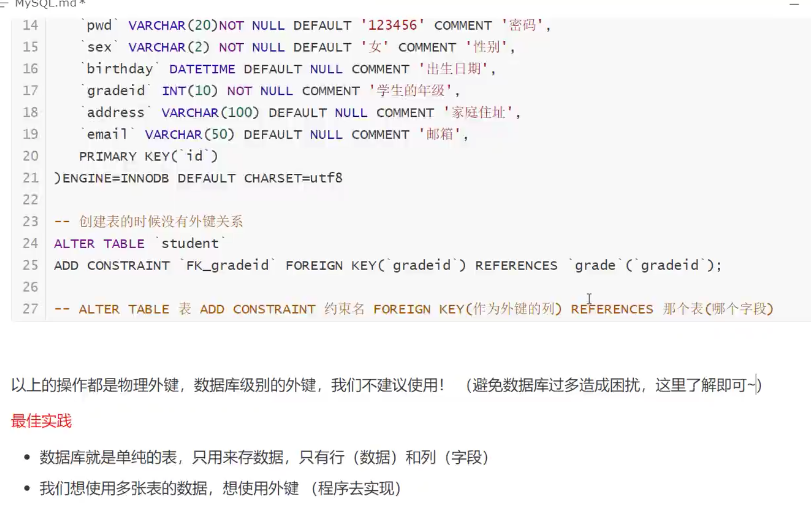


### 3.2 DML语言(全部记住)


### 3.3 添加

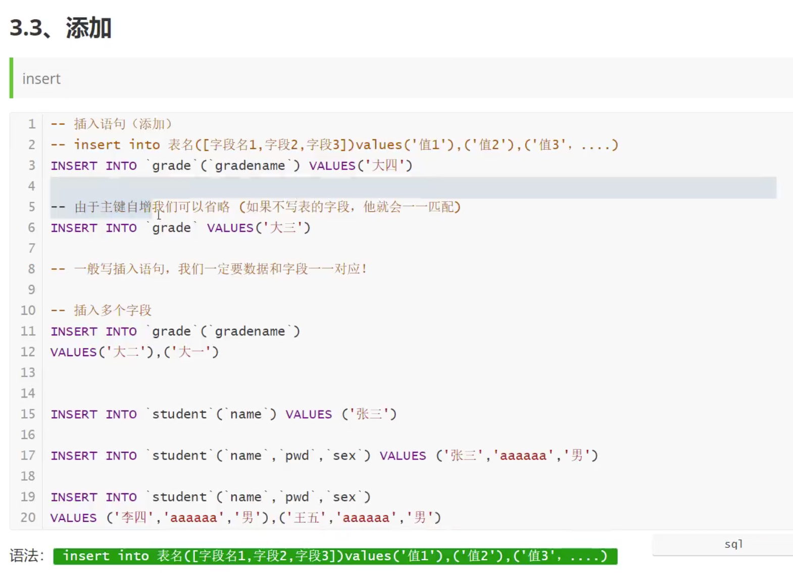


### 3.4 修改

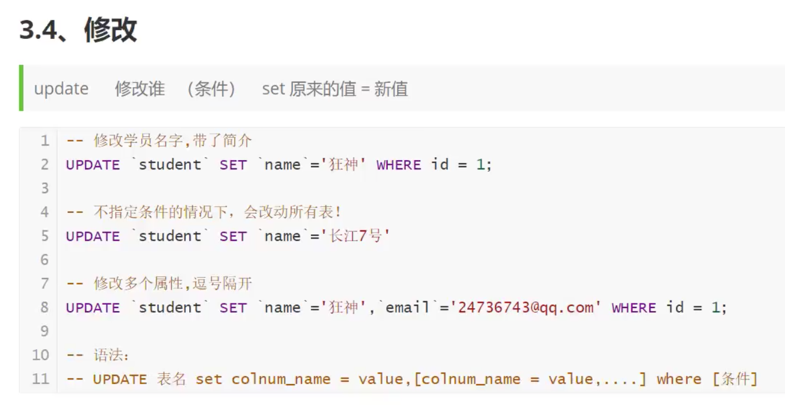

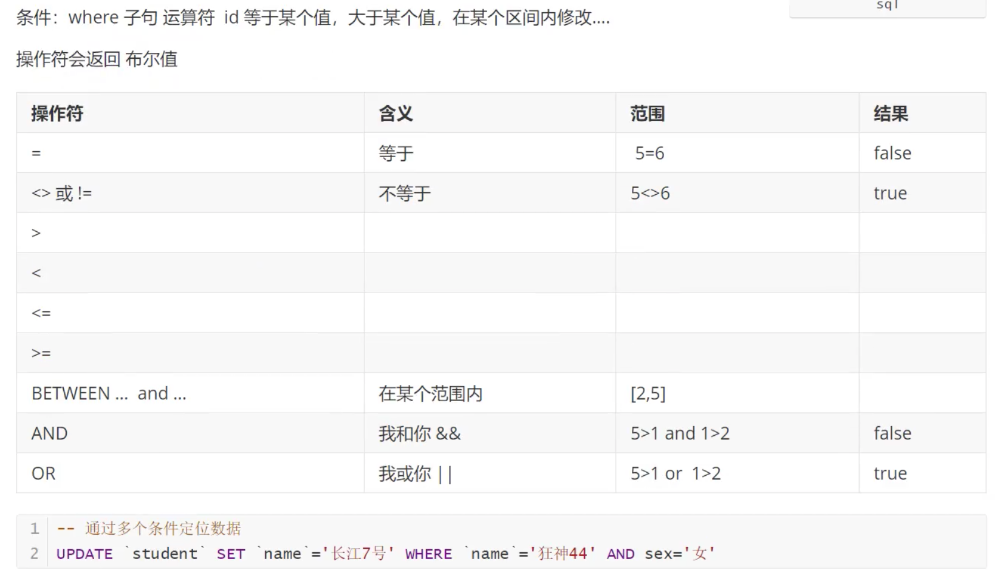

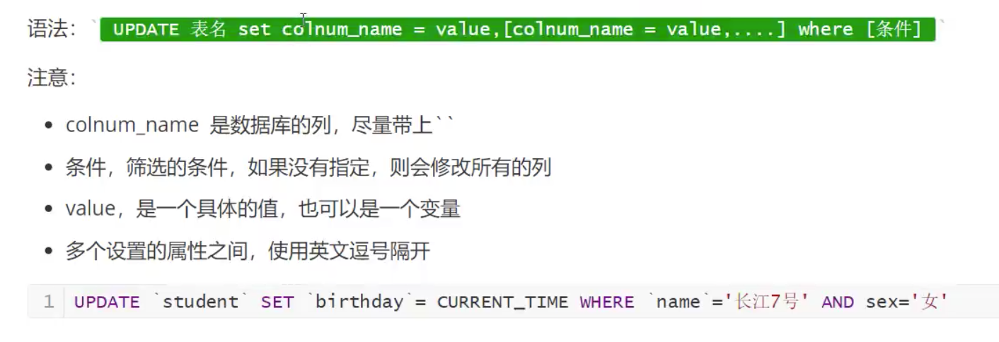

### 3.5 删除

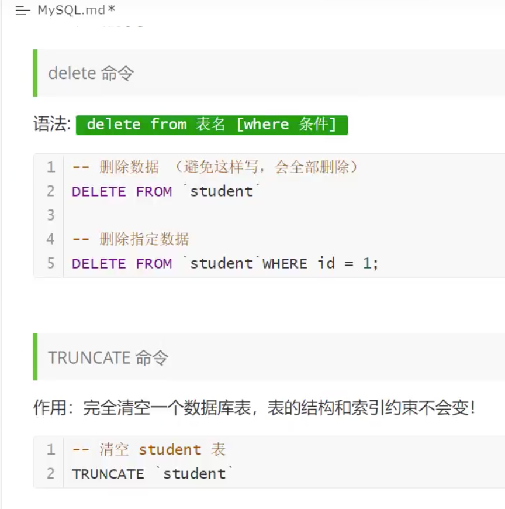

- 两者删除方法的不同

  

## 4. DQL查询数据(最重点)

### 4.1 DQL

(Data Query Language: 数据查询语言)

- 所有的查询操作都用它 Select
- 简单的查询, 复杂的查询它都能做
- 数据库中最核心的语言, 最重要的语句

- 使用频率最高的

### 4.2 查询所有字段


### 4.3

https://www.bilibili.com/video/BV1NJ411J79W?p=17

