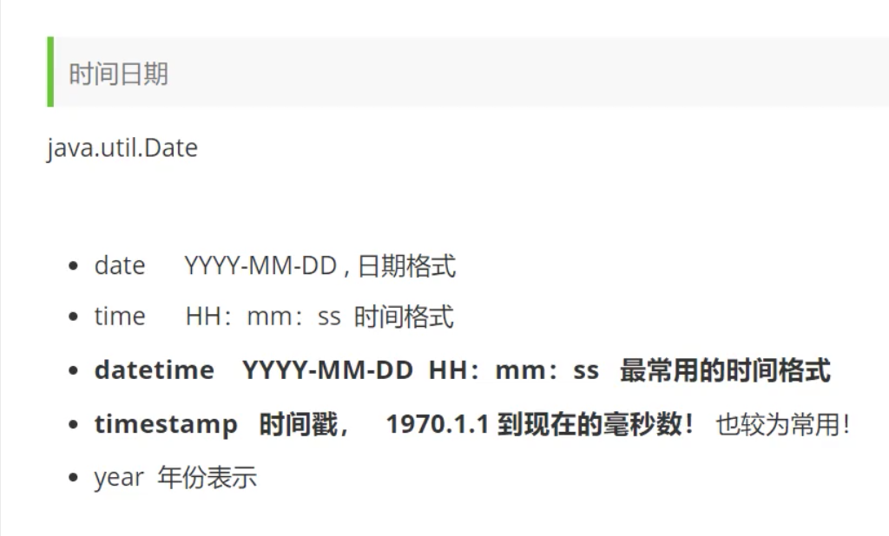
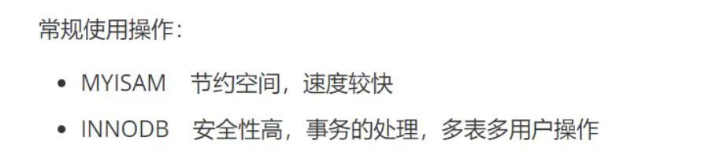
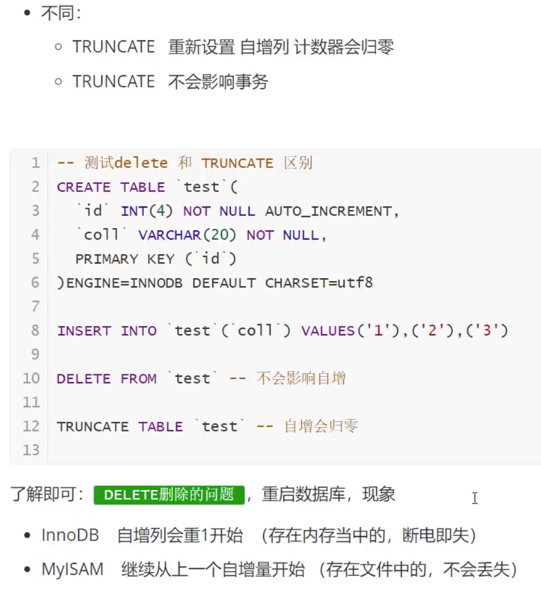

# [【狂神说Java】MySQL最新教程通俗易懂](https://www.bilibili.com/video/BV1NJ411J79W)

## 参考

[【狂神说 Java】MySQL 最新教程通俗易懂](https://www.bilibili.com/video/BV1NJ411J79W)

## 数据库分类

- 关系型数据库 (SQL)

  MySQL SQLlite

- 非关系型数据库(NoSQL) Not only SQL

  对象存储

  Redis, MongDB

## MySQL Docker 配置

- MySQL 版本: 5.7.19

- 首次运行

  端口: 3306

  root 密码: 123456

  ```shell
  docker run -itd --name mysql-test -p 3306:3306 -e MYSQL_ROOT_PASSWORD=123456 mysql:5.7.19
  ```

- 启动

  ```shell
  docker start 实例id
  ```

- 停止

  ```shell
  docker stop 实例id
  ```

- 进入 MySQL 命令行

  ```shell
  docker exec -it 实例id mysql -u root -p
  ```

## MySQL 命令

``` shell
show databases; 	--查看所有数据库
```

```shell
use school; --切换到 school数据库
```

```shell
describe student; --查看表的信息
```

```shell
creat database school; --创建数据库school
```

```shell
exit;--退出
```

- if 语句

  如果不存在数据库 school 则创建数据库 school

```sql
CREATE DATABASE IF NOT EXISTS school;
```

- 如果表名或者字段名为 SQL 保留字, 用反单引号 Tab 键上面那个引起来

  ```sql
  USE `user`;
  ```

- 从已经建好的表中获取新建表的命令

  可以先用软件手动建好表, 再导出

  ```SQL
  SHOW CREATE DATABASE 数据库名字
  ```

  ```sql
  	SHOW CREATE TABLE 数据表名称
  ```

  - 例子

  ```sql
  CREATE DATABASE `school` /*!40100 DEFAULT CHARACTER SET utf8 */
  ```

  - ```sql
    student	CREATE TABLE `student` (↵  `id` int(11) unsigned NOT NULL AUTO_INCREMENT COMMENT '学员id',↵  `name` varchar(100) NOT NULL DEFAULT '' COMMENT '姓名',↵  `age` int(3) NOT NULL COMMENT '年龄',↵  PRIMARY KEY (`id`)↵) ENGINE=InnoDB AUTO_INCREMENT=3 DEFAULT CHARSET=utf8
    ```

- DESC 表名: 显示表的结构.
- 修改表名
- 增加表的字段
- 修改表的字段


- 删除

  

## 数据类型

- 数值

  

- 字符串

  

- 时间日期

  

- null

  

## 数据库字段属性(重要)


拓展:


## 数据表的类型





### 字符集编码


## 3. MySQL 数据管理

### 3.1 外键(了解即可)


### 3.2 DML 语言(全部记住)

### 3.3 添加


### 3.4 修改


### 3.5 删除


- 两者删除方法的不同

  

## 4. DQL 查询数据(最重点)

### 4.1 DQL

(Data Query Language: 数据查询语言)

- 所有的查询操作都用它 Select
- 简单的查询, 复杂的查询它都能做
- 数据库中最核心的语言, 最重要的语句

- 使用频率最高的

### 4.2 查询所有字段


### 4.3

https://www.bilibili.com/video/BV1NJ411J79W?p=17


## [P1 1、什么是数据库，为什么要学习数据库](https://www.bilibili.com/video/BV1NJ411J79W?p=1)
## [P2 2、初识Mysql，关系型和非关系型数据库区别](https://www.bilibili.com/video/BV1NJ411J79W?p=2)
## [P3 3、安装MySQL详细说明](https://www.bilibili.com/video/BV1NJ411J79W?p=3)
## [P4 4、Sqlyog软件安装和使用](https://www.bilibili.com/video/BV1NJ411J79W?p=4)
## [P5 5、基本的命令行操作](https://www.bilibili.com/video/BV1NJ411J79W?p=5)
## [P6 6、操作数据库语句](https://www.bilibili.com/video/BV1NJ411J79W?p=6)
## [P7 7、列的数据类型讲解](https://www.bilibili.com/video/BV1NJ411J79W?p=7)
## [P8 8、数据库的字段属性](https://www.bilibili.com/video/BV1NJ411J79W?p=8)
## [P9 9、创建数据库表](https://www.bilibili.com/video/BV1NJ411J79W?p=9)
## [P10 10、MyISAM和InnoDB区别](https://www.bilibili.com/video/BV1NJ411J79W?p=10)
## [P11 11、修改和删除数据表字段](https://www.bilibili.com/video/BV1NJ411J79W?p=11)
## [P12 12、数据库级别的外键](https://www.bilibili.com/video/BV1NJ411J79W?p=12)
## [P13 13、Insert语句详解](https://www.bilibili.com/video/BV1NJ411J79W?p=13)
## [P14 14、Update语句详解](https://www.bilibili.com/video/BV1NJ411J79W?p=14)
## [P15 15、Delete和Truncate详解](https://www.bilibili.com/video/BV1NJ411J79W?p=15)
## [P16 16、基本的Select语句和别名使用](https://www.bilibili.com/video/BV1NJ411J79W?p=16)
## [P17 17、去重及据库的表达式](https://www.bilibili.com/video/BV1NJ411J79W?p=17)
## [P18 18、Where子句之逻辑运算符](https://www.bilibili.com/video/BV1NJ411J79W?p=18)
## [P19 19、模糊查询操作符详解](https://www.bilibili.com/video/BV1NJ411J79W?p=19)
## [P20 20、联表查询JoinON详解](https://www.bilibili.com/video/BV1NJ411J79W?p=20)
## [P21 21、自连接及联表查询练习](https://www.bilibili.com/video/BV1NJ411J79W?p=21)
## [P22 22、分页和排序](https://www.bilibili.com/video/BV1NJ411J79W?p=22)
## [P23 23、子查询和嵌套查询](https://www.bilibili.com/video/BV1NJ411J79W?p=23)
## [P24 24、MySQL常用函数](https://www.bilibili.com/video/BV1NJ411J79W?p=24)
## [P25 25、聚合函数及分组过滤](https://www.bilibili.com/video/BV1NJ411J79W?p=25)
## [P26 26、拓展之数据库级别的MD5加密](https://www.bilibili.com/video/BV1NJ411J79W?p=26)
## [P27 27、Select小结](https://www.bilibili.com/video/BV1NJ411J79W?p=27)
## [P28 28、事务ACID原则、脏读、不可重复读、幻读](https://www.bilibili.com/video/BV1NJ411J79W?p=28)
## [P29 29、测试事务实现转账](https://www.bilibili.com/video/BV1NJ411J79W?p=29)
## [P30 30、索引介绍及索引的分类](https://www.bilibili.com/video/BV1NJ411J79W?p=30)
## [P31 31、SQL编程创建100万条数据测试索引](https://www.bilibili.com/video/BV1NJ411J79W?p=31)
## [P32 32、索引原则和明日安排](https://www.bilibili.com/video/BV1NJ411J79W?p=32)
## [P33 33、数据库用户管理](https://www.bilibili.com/video/BV1NJ411J79W?p=33)
## [P34 34、MySQL备份](https://www.bilibili.com/video/BV1NJ411J79W?p=34)
## [P35 35、如何设计一个项目的数据库](https://www.bilibili.com/video/BV1NJ411J79W?p=35)
## [P36 36、数据库的三大范式](https://www.bilibili.com/video/BV1NJ411J79W?p=36)
## [P37 37、数据库驱动和JDBC](https://www.bilibili.com/video/BV1NJ411J79W?p=37)
## [P38 38、第一个JDBC程序](https://www.bilibili.com/video/BV1NJ411J79W?p=38)
## [P39 39、JDBC中对象解释](https://www.bilibili.com/video/BV1NJ411J79W?p=39)
## [P40 40、Statement对象详解](https://www.bilibili.com/video/BV1NJ411J79W?p=40)
## [P41 41、SQL注入问题](https://www.bilibili.com/video/BV1NJ411J79W?p=41)
## [P42 42、PreparedStatement对象](https://www.bilibili.com/video/BV1NJ411J79W?p=42)
## [P43 43、使用IDEA连接数据库](https://www.bilibili.com/video/BV1NJ411J79W?p=43)
## [P44 44、JDBC操作事务](https://www.bilibili.com/video/BV1NJ411J79W?p=44)
## [P45 45、DBCP-C3P0连接池](https://www.bilibili.com/video/BV1NJ411J79W?p=45)