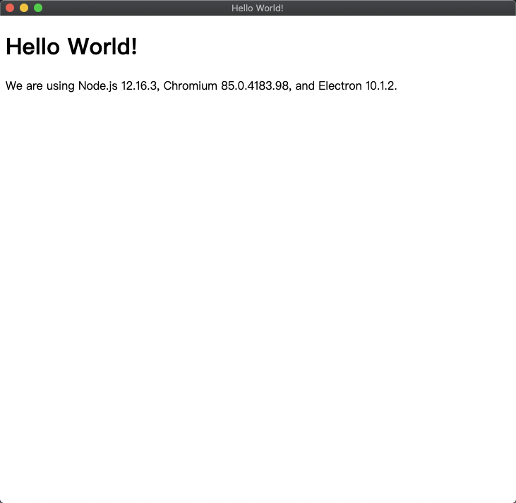

# [Electron 免费视频教程-从基础到实战](https://www.bilibili.com/video/BV177411s7Lt?p=3)

## 参考

[Electron 免费视频教程-从基础到实战](https://www.bilibili.com/video/BV177411s7Lt?p=3)

## 安装

1. node.js 安装

   官网下载安装包安装即可

2. Electron 安装

   ```sh
   sudo npm install electron -g --unsafe-perm=true --allow-root
   ```

   npm 命令前都要加 sudo, 不然会权限不足.

3. 官方的例子

   ```sh
   git clone https://github.com/electron/electron-quick-start
   cd electron-quick-start
   npm install
   npm start
   ```

   

## [P1 01\_课程介绍和 Electron 简介](https://www.bilibili.com/video/BV177411s7Lt?p=1)

## [P2 02_Electron 开发环境搭建](https://www.bilibili.com/video/BV177411s7Lt?p=2)

## [P3 03_Electron 编写一个 HelloWorld](https://www.bilibili.com/video/BV177411s7Lt?p=3)

## [P4 04_Electron 编写邀请小姐姐程序](https://www.bilibili.com/video/BV177411s7Lt?p=4)

## [P5 05_Electron 中 Remote 模块讲解](https://www.bilibili.com/video/BV177411s7Lt?p=5)

## [P6 06_Electron 中菜单的创建和绑定事件](https://www.bilibili.com/video/BV177411s7Lt?p=6)

## [P7 07_Electron 中右键菜单的制作](https://www.bilibili.com/video/BV177411s7Lt?p=7)

## [P8 08_Electron 中通过链接打开浏览器](https://www.bilibili.com/video/BV177411s7Lt?p=8)

## [P9 09_Electron 中嵌入网页和打开子窗口](https://www.bilibili.com/video/BV177411s7Lt?p=9)

## [P10 10_Electron 子窗口向父窗口传递信息](https://www.bilibili.com/video/BV177411s7Lt?p=10)

## [P11 11_Electron 选择文件对话框使用](https://www.bilibili.com/video/BV177411s7Lt?p=11)

## [P12 12_Electron 保存文件对话框使用](https://www.bilibili.com/video/BV177411s7Lt?p=12)

## [P13 13_Electron 消息对话框操作](https://www.bilibili.com/video/BV177411s7Lt?p=13)

## [P14 14_Electron 断网提醒功能制作](https://www.bilibili.com/video/BV177411s7Lt?p=14)

## [P15 15_Electron 底部通知消息制作](https://www.bilibili.com/video/BV177411s7Lt?p=15)

## [P16 16_Electron 注册全局快捷键](https://www.bilibili.com/video/BV177411s7Lt?p=16)

## [P17 17\_剪切板功能的使用](https://www.bilibili.com/video/BV177411s7Lt?p=17)
