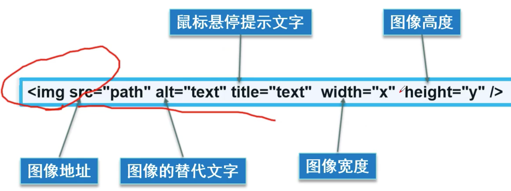
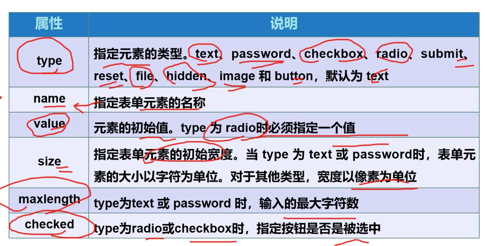
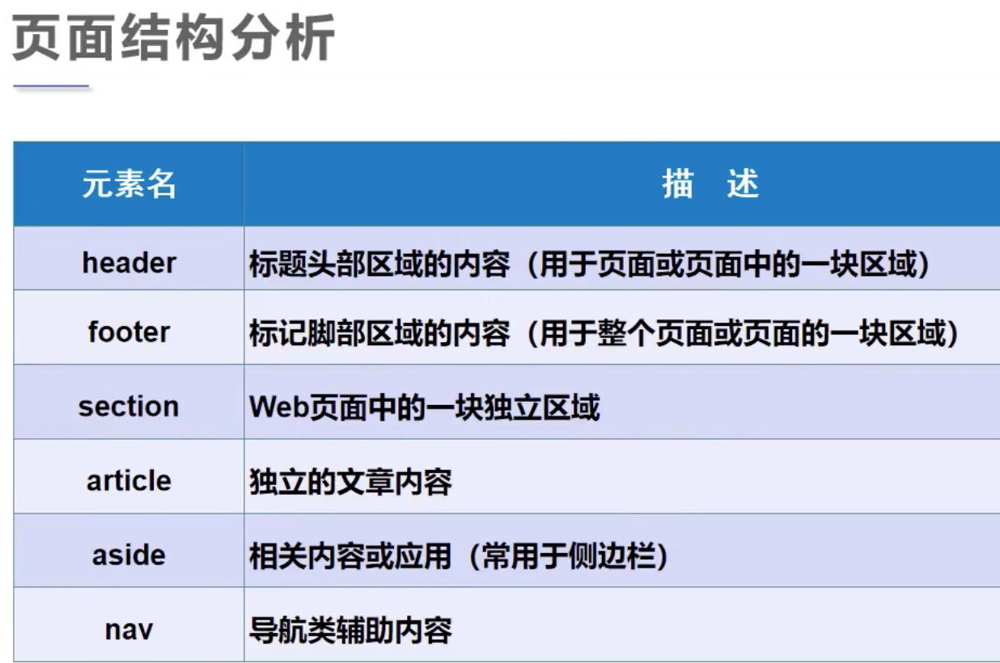

# html笔记

## 基本标签

- h标签
  
- 最多h6 没有h7
  
- i标签

  斜体字

- hr标签

  水平线,单标签

- p标签

  段落标签,源码里的换行无效

- b标签

  字体加粗

- br标签

  换行

- ```&nbsp;```标签

  空格.直接在源码里写多个空格,浏览器只识别一个空格,用多个```&nbsp;```解决

- img标签

  

  - width属性 

    - 100px

    - 100%

      占满整个窗口

- a标签

  超链接

  - target="_blank"

    新标签页打开

- ul和li

  无序标签

  ul属性

  - type= "disc"

    实心圆

  - type= "circle"

    空心圆

  - type= "square"

    实心方块

- dl dt dd

  列表

- table

  td tr rowspan属性 合并行?列

- video

  https://www.bilibili.com/video/BV1x4411V75C?p=9

- audio

- ol和li标签

  数字有序标签,和ul相对

  ol

  - type="1"

    数字(默认)

  - type="a"

    小写字母

  - type="A"

    大写字母

  - type="i"

    小写罗马字母

  - type="I"

    大写罗马字母

  <a href="https://www.google.com" target="_blank">新标签页打开</a>

- [input标签](https://www.bilibili.com/video/BV17z4y1D7Yj?p=14)

  - type属性

    - submit
- reset
    - text
- password
    - button
    - radio:单选框.
    - checkbox:多选框

  - name
  
  - value
  
  - size
  
  - maxlength
  
  - checked
  
    

- iframe

  

- form

  

- button

- select
- textarea
- label

表单

- 隐藏域

表单初级验证

- placeholder

  提示信息

- required

  元素不能为空

- pattern

  正则表达式判断输入

## 行内元素和块元素

- 块元素

  无论内容多少, 该元素独占一行

  p h1~h6

- 行内元素

  内容撑开宽度, 左右都是行内元素的可以排在一行

  a strong em(斜体)

## 页面结构分析



