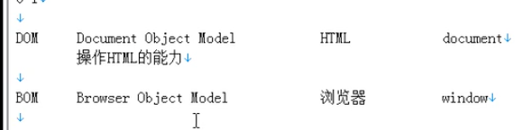
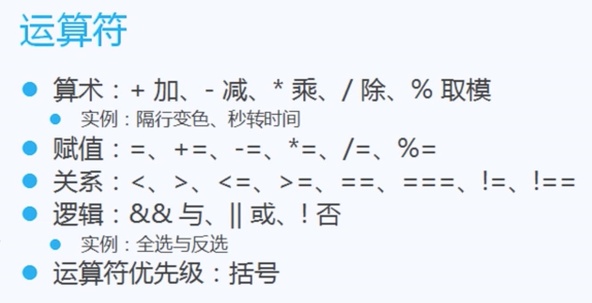
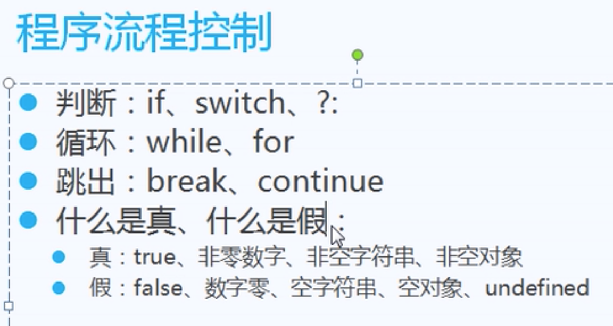
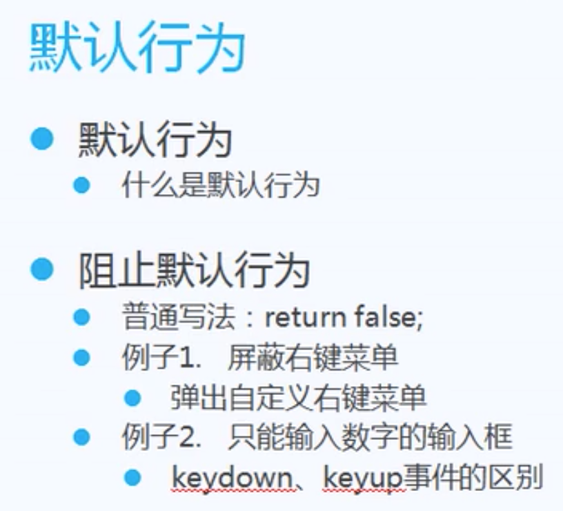
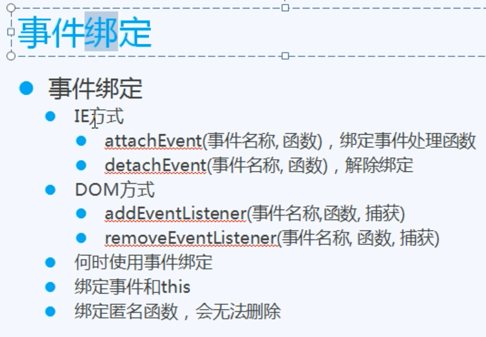
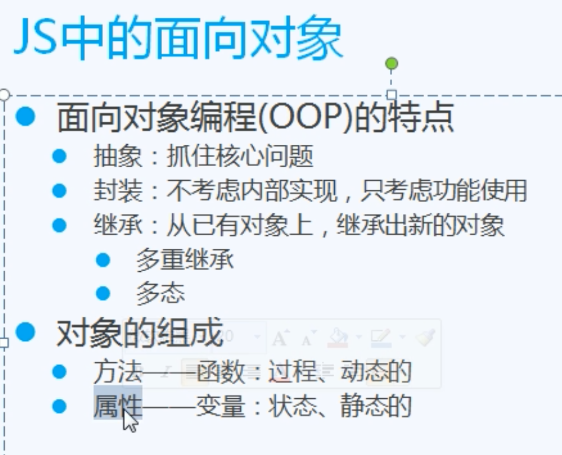
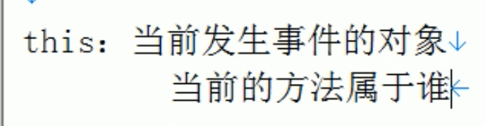
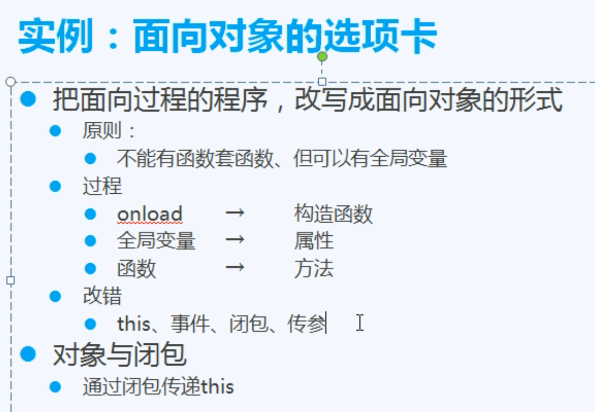
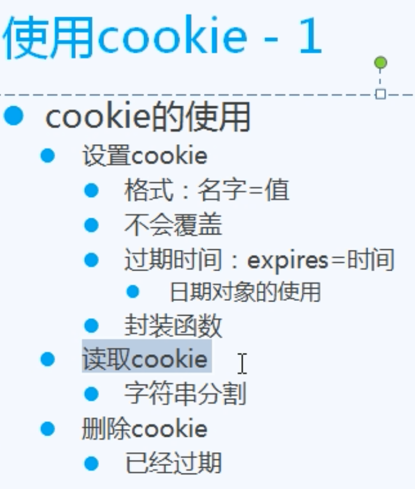

# [JavaScript](https://www.bilibili.com/video/BV1LW411Q7qV)

[别人的本课程笔记](https://github.com/chengziqaq/JavaScript_notes)

## JavaScript是什么

与用户交互的编程语言,可修改html标签和css

## 初识JavaScript

### 函数传参

### 操作属性的两个方法

#### div1.value=''11111'

日常操作

#### div['value']='11111'

适用于将属性名作为参数传递

### 提取行间事件

为元素添加事件

### window.onload

当页面加载完再执行此JavaScript脚本

### 获取一组元素

document.getElementsByTagName('div');

### 循环 if 和java的一样

### 选项卡

### JS简易日历

#### innerHTML

某个标签的innerHTML属性可以获取内部值,也可以赋值.

## JavaScript基础

### DOM

Document Object Model

操作html的能力

### BOM



### 变量类型

number string boolean undefined object function

NaN:非数字,NaN不等于其他NaN,isNaN()判断是否为NaN

alert(typeof 变量):显示变量类型

### 字符串转数字

parseInt(a)

### 运算符



### 流程控制



#### ?运算符:

```JavaScript
条件?语句1:语句2 = 

if(条件){
  语句1;
}
else:
	语句2;
```

条件为真,执行语句1,为假执行语句2.

#### break和continue

```javascript
for(var i=1;i<=5;i++){
		if(i==2){
			break;
			//continue;
		}
		alert("Hi" + i);
}	
```

break中断整个for循环,continue中断i==2的那一次循环.

#### 真与假

真: true 非零数字 非空字符串 非空对象

假: false 数字0 空字符串 null 空对象 undefined

空的相关的为假 非空为真

#### Json

```JavaScript
const json = {a: 2, b: 5, c:9};
```

json.a 或者json['a']输出 2

json没有length属性

循环json

for(var i in json){}

老师建议: 循环数组用 array.length 循环json用 for in,不然可能出问题

## 深入 JavaScript

### 不定参数

### 数组基础

## 定时器的使用

## 7.21学了dom基础 下一个

## [DOM操作应用]( https://www.bilibili.com/video/BV1LW411Q7qV?p=12)

这个视频需要多看几次,然后动手写

### 创建 

#### createElement

#### appendChild

### 插入 

#### insertBefore

### 删除

#### removeChild


### 文档碎片

#### document.creatDocumentFragment(少用)


```html
## DOM 操作应用

### 创建、插入和删除元素

- 创建 DOM 元素

  - `document.createElement(标签名)`	创建一个节点，不渲染
  - `父级.appendChild(子节点)` 添加到末尾   并渲染
    - 例子：为 `ul` 插入 `li`

- 插入元素

  - `父级.insertBefore(节点, 在谁之前)`	在已有元素前插入
    - 例子：倒叙插入 `li`

- 删除 DOM 元素

  - `父级.removeChild(节点)` 	删除一个节点
    - 例子：删除 `li`

- 代码：

  ```HTML
  <!DOCTYPE html>
  <html>
    <head>
      <meta http-equiv="Content-Type" content="text/html;charset=UTF-8">
      <title>DOM创建插入删除元素</title>
      <script>
        window.onload = function () {
          // 封装getElementById
          function get(id) {
            return document.getElementById(id);
          };
  
          // 在 ul 下增加 li
          let oUl = get('u1');
          get('btn1').onclick = function () {
            let oLi = document.createElement('li');
            let sL = get('txt1').value + "<a href='javascript:;'>删除</a>";
            oLi.innerHTML = sL;
            oUl.appendChild(oLi);
            aRemove();
          };
          // 从 ul 下插入 li
          get('btn2').onclick = function () {
            let oLi = document.createElement('li');
            let aLi = document.getElementsByTagName('li');
            let sL = get('txt1').value + "<a href='javascript:;'>删除</a>";
            let i = get('txt2').value - 1;
            oLi.innerHTML = sL;
            if (aLi.length > i && aLi.length > 0) {
              oUl.insertBefore(oLi, aLi[i]);
            } else {
              oUl.appendChild(oLi);
            }
            aRemove();
          };
          // 从 ul 下删除 li
          get('btn3').onclick = function () {
            let aLi = document.getElementsByTagName('li');
            let i = get('txt2').value - 1;
            if (i < aLi.length && i >= 0) {
             oUl.removeChild(aLi[i]);
            } else {
              alert('找不到第'+ (parseInt(i) + 1) +'个li');
            }
          };
  
          // this 从 ul 删除 li
          function aRemove() {
            let aA = document.getElementsByTagName('a');
            let i =0
            for (i = 0; i < aA.length; i++) {
              aA[i].onclick = function () {
                oUl.removeChild(this.parentNode);
              }
            }
          }
        }
      </script>
    </head>
    <body>
      <input type="text" name="" id="txt1" value="123">
      <input type="button" name="" id="btn1" value="增加">
      <input type="text" name="" id="txt2" value="1">
      <input type="button" name="" id="btn2" value="插入">
      <input type="button" name="" id="btn3" value="删除">
      <div is="d1">
        <ul id="u1">
        </ul>
      </div>
    </body>
  </html>
```

## [DOM操作高级应用](https://www.bilibili.com/video/BV1LW411Q7qV?p=13)

### 表格(少用)

#### 获取

##### tBodies

##### tHead

##### tFoot

##### rows

##### cells

### 表单  


#### 表单事件

##### onsubmit

##### onreset

## JavaScript运动(跳过了)

## [JavaScript事件基础](https://www.bilibili.com/video/BV1LW411Q7qV?p=20)

### 冒泡事件以及取消

### 鼠标事件

oEvent.clientX

oEvent.clientY

老师建议: 用到上面的两个函数 一定要加上scrollTop 不然肯定初问题

### 键盘事件

42分钟处有鼠标点击或按回车键 提交留言功能 以后写插件会用到的 可供参考

## JS事件中级

[https://github.com/chengziqaq/JavaScript_notes#js-%E4%BA%8B%E4%BB%B6%E4%B8%AD%E7%BA%A7](https://github.com/chengziqaq/JavaScript_notes#js-事件中级)

https://www.bilibili.com/video/BV1LW411Q7qV?p=21&t=10



## JS 事件高级应用

 [https://github.com/chengziqaq/JavaScript_notes#js-%E4%BA%8B%E4%BB%B6%E9%AB%98%E7%BA%A7%E5%BA%94%E7%94%A8](https://github.com/chengziqaq/JavaScript_notes#js-事件高级应用)

https://www.bilibili.com/video/BV1LW411Q7qV?p=22



## AJAX基础

https://www.bilibili.com/video/BV1LW411Q7qV?p=24

[https://github.com/chengziqaq/JavaScript_notes#ajax-%E5%9F%BA%E7%A1%80](https://github.com/chengziqaq/JavaScript_notes#ajax-基础)

ajax从服务器读取json数据 通过操作dom填入到网页中

## 面向对象



### this



### window

全局方法属于window

不能在系统对象中随意附加方法、属性，否则会覆盖已有方法、属性

## 面向对象高级



## BOM(操作浏览器的)

## Cookie



