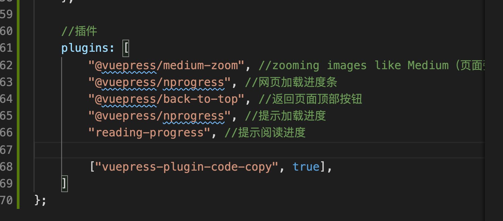

# vuePress + GitPages + Travis Ci + MarkDown 笔记网站实现过程

## 1. 安装

### 1.1 安装 Nodejs

注意 Nodejs 版本过高可能会安装 vuePress 失败

### 1.2 安装 vuePress

https://vuepress.vuejs.org/zh/guide/getting-started.html

```sh
mkdir Note && cd Note
```

```sh
sudo npm install -D vuepress
```

```sh
mkdir docs && echo # Hello VuePress > docs/README.md
```

在 package.json 中添加配置文件

```json
{
  "scripts": {
    "docs:dev": "vuepress dev docs",
    "docs:build": "vuepress build docs"
  }
}
```

在本地启动服务器

```sh
npm run docs:dev
```

访问 [http://localhost:8080/](http://localhost:8080/)


## 2. vuePress 配置

[VuePress 快速上手](https://vuepress.vuejs.org/zh/guide/getting-started.html)

接着跟着官方文档做

后来参考

[创建 VuePress + GithubPages + TravisCI 在线文档](https://tsanfer.github.io/VuePress-GithubPages-TravisCI/pages/VuePress.html#vuepress-%E7%9B%AE%E5%BD%95%E7%BB%93%E6%9E%84)

复制上面教程里的文件, 修改 packeage.json 中 dependence 的版本

1. package.json

```json
{
  "name": "note",
  "version": "1.0.0",
  "description": "notes",
  "main": "index.js",
  "scripts": {
    "docs:dev": "vuepress dev docs",
    "docs:build": "vuepress build docs"
  },
  "devDependencies": {
    "vuepress": "^1.6.0",
    "@vuepress/plugin-active-header-links": "^1.6.0",
    "@vuepress/plugin-medium-zoom": "^1.6.0",
    "@vuepress/plugin-nprogress": "^1.6.0",
    "@vuepress/plugin-back-to-top": "^1.6.0"
  }
}
```

2. config.js , 在此基础上修改

   需要修改的主要有仓库信息 和 导航栏, 看注释就知道怎么改了

3. Typeora 图片路径问题

   [[Vuepress 图片资源中文路径问题](https://segmentfault.com/a/1190000022275001)]

   不过这网站的行为令人恶心, 复制代码必须登录, 登录必须绑定手机号, 这种网站还是远离吧.

   

- 安装插件( 插件的 [Github 地址](https://github.com/nanyuantingfeng/markdown-it-disable-url-encode/blob/1e7c1bb261f5bf6c8db88a0db90b36d45e2850dd/index.js#L30))

  ```sh
  npm i markdown-it-disable-url-encode
  ```

- 增加插件到配置文件

  ```sh
  //markdown扩展
  markdown: {
    lineNumbers: true, //是否在每个代码块的左侧显示行号
      // Typeora图片路径问题
      extendMarkdown: md => {
        md.use(require("markdown-it-disable-url-encode"))
      }
  ```

经过测试, 能使用了, 但是图片路径名有中文的会使得整个 .md 文件不显示了(推测是打包失败.)

所以接下来迁移 md 笔记的时候有中文路径需要替换.

[TextMate](https://macromates.com/): 一个好用的文本替换软件

推荐来自: [Opencore Guide](https://dortania.github.io/OpenCore-Install-Guide/CONTRIBUTING.html#tips)

4. 增加代码复制功能

   [vuepress 添加复制代码块功能](https://blog.csdn.net/qq_39367226/article/details/107449893)

   ```sh
   npm install vuepress-plugin-code-copy
   ```

   追加插件启用配置代码 config.js

   ```javascript
   ["vuepress-plugin-code-copy", true],
   ```

   结果如图

   

## 3. MarkDown 笔记迁移

1. 上面提到 md 文档中图片路径不能为中文

2. 只能使用相对路径, 且不能使用 html 的 img 标签,

   后期打算将图片统一放在另外的目录, 本次迁移就不改了, 太过于麻烦

   后来发现 凡是有标签的 都会检测 不闭合会出错 如: `<filename>`

   可以用 反引号引住解决

3. md 文件中, 有关 html 的标签, 必须闭合, vuePress 会检测 html 标签, 出错页面不会显示, 代码块里的代码不检测.

4. 用中文会有各种意想不到的错误( 不一定 最好还是全用英文)

侧边栏指示的文件如果不存在, 侧边栏不会显示.

4. 经过三四个小时的迁移, 接下来看怎样优化导航栏以及笔记内容和排版

   参考

   1. [CS-Notes](https://cyc2018.github.io/CS-Notes/#/README)
   2. [中文文案排版指北](https://github.com/sparanoid/chinese-copywriting-guidelines/blob/master/README.zh-CN.md)

## 4. 推送项目到 github

项目比较大, 分了多次上传, 否则 github 会拒绝接受.

## 5. 生成静态文件并推送到 gh-pages 分支

生成 html 文件并推送到 仓库的 gh-pages 分支

生成 html 文件, 项目根目录下

```shell
npm run build
```

接着看官方教程

https://vuepress.vuejs.org/zh/guide/deploy.html#github-pages

切换到 .vuepress/dist 目录下, 将此文件夹的内容推送到 gh-pages 分支

```shell
git init
```

```shell
git add -A
```

```shell
git commit -m 'deploy'
```

```shell
git push -f git@github.com:chengziqaq/Note.git master:gh-pages
```

上一个命令推送失败 因为没有访问权限, 需要添加本机的公钥

需要先在本地生成 公钥 win10 系统

参考:

https://tsanfer.github.io/VuePress-GithubPages-TravisCI/pages/Github.html#ssh%E5%AF%86%E9%92%A5%E9%93%BE%E6%8E%A5github

```cmd
ssh-keygen
```

复制 用户目录下的公钥内容添加到 github 的公钥设置上.

再次 push , 等了几分钟, 推送成功. 这时候查看 git page 应该就会看到效果了.

访问 https://chengziqaq.github.io/Note/ ok 了

## 6. 配置自动构建

以后我只需要在本地编辑 md 文件, 推送之后, 就会自动构建. GitAction 和 Travis CI 都可以实现, 官方文档用的后者, 我也就跟着用这个.

1. 用 Github 账号登录 Travis CL

2. 在 Travis CL 仓库设置中 填入 刚才在 Github 生成的 Token

3. 测试推送第一次 看 build 日志 发现构建成功, 推送上 github 的时候提示 Token 无效,

   网上搜索了一下, 叫我重新生成一个 Token. 照做了, 再次推送自动构建成功.

## 7. 修改 左侧栏导航 和 顶部导航

​ 待补充

## 8. 总结

​ 待补充
