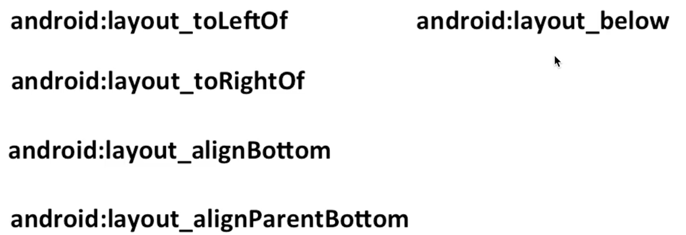

# Android

## 参考资料：

[【天哥】Android 开发视频教程最新版 Android Studio 开发](https://www.bilibili.com/video/BV1Rt411e76H)

[天哥写的部分(master)和我网友写的(beta)部分代码](https://github.com/taifus/Android_Learning)

## 2.1 布局管理器

线性布局和相对布局用的多，其他不常用。

### 2.1.1 线性布局 LinearLayout

#### 前端类似部分

- 布局宽高度通常使用 dp 而不是 px，这样便于布局适配屏幕

- padding 和 css 的一样

- 这个什么意思？

  orientation：方向。子元素排列对齐方向。

  ```xml
  android:orientation="horizontal"
  ```

- 匹配父空间

  布局文件从上到下开始，把前面的分配好了，剩下的内容给匹配父空间的。

  ```xml
  <?xml version="1.0" encoding="utf-8"?>
  <LinearLayout xmlns:android="http://schemas.android.com/apk/res/android"
      android:layout_width="match_parent"
      android:layout_height="match_parent">

      <LinearLayout
          android:id="@+id/ll_1"
          android:layout_width="200dp"
          android:layout_height="200dp"
          android:orientation="horizontal"
          android:background="#000000"
          android:padding="20dp">
  ```


          <View
              android:layout_width="match_parent"
              android:layout_height="match_parent"
              android:background="#FF0033"/>
      </LinearLayout>
    
      <LinearLayout
          android:layout_width="match_parent"
          android:layout_height="200dp"
          android:orientation="horizontal"
          android:background="#0066FF">
    
      </LinearLayout>


  </LinearLayout>

  ```

  第一个 LinearLayout 用了 父空间的 200dp 宽度，

  父空间剩下的宽度 = 父空间宽度 - 200dp，给第二个 LinearLayout

- LinearLayout 默认水平排列，改成垂直排列需要修改父布局的属性

  ```xml
  android:orientation="vertical">
  ```

* 设置两个子布局的边距

  用 margin

#### View 默认从左上排列

设置父元素的对齐方式属性改变这以默认行为

```xml
android:gravity="center"
```

再加一个 View 元素，并让他们各占一半，引出下一个属性

#### 权重 weight ：按比例分配

```xml
android:layout_weight="1"
```

开始 width 属性都是设置的是 0dp

```xml
        <View
            android:layout_width="0dp"
            android:layout_height="match_parent"
            android:background="#000000"
            android:layout_weight="1"
            />

        <View
            android:layout_width="0dp"
            android:layout_height="match_parent"
            android:background="#ff0033"
            android:layout_weight="1"/>
```

现在：前一个设置的是 50dp，第一个会比第二个宽 50 dp

这是由于：weight 属性是从父空间先取出 第一个 View 中需要的 50 dp 后再按照 weight 比例来分的。若此时将第二个 width 也设置为 50 dp 他们又会同样宽了。

简单来说：weight 属性是将剩余内容按权重分配。width 属性设置为 0px 就行。 width 属性优先级大于 weight。

```xml
        <View
            android:layout_width="50dp"
            android:layout_height="match_parent"
            android:background="#000000"
            android:layout_weight="1"
            />

        <View
            android:layout_width="0dp"
            android:layout_height="match_parent"
            android:background="#ff0033"
            android:layout_weight="1"/>
```

布局可以嵌套，多练习，不练习没用。

果然工作过的人出来讲课比没开发经验的老师讲课好多了，并且比我自己看书效率高多了，

学习 Android 开发，我最害怕的就是界面设计。他把常用的讲了并且易懂，反观老师就是把书上的

挨着讲，讲的又多又不具体。

### 2.1.2 相对布局 Relativelayout

相对布局中的相对是参照的意思。

align：排整齐;校准;(尤指)使成一条直线;使一致。 我遇见的意思多指：对齐方式。

#### 常用属性



看字面意思就能明白用法。

1. 在谁的左边、右边，底部对齐，对齐父空间底部、below 是下划线。

注意：安卓的布局文件命名只能小写字母加数字，否则不识别。

#### 作业

百度搜或者看你手机上的软件，可以只用 View 视图把他们的界面模仿出来，大致布局即可。

## 2.2 TextVie

### 2.2.1 常用属性

- 文字大小、颜色

  text

  textColor

  textSize：常用单位为 sp

- 显示不下用 ... 省略

- 文字 + icon

- 中划线、下划线

- 跑马灯


