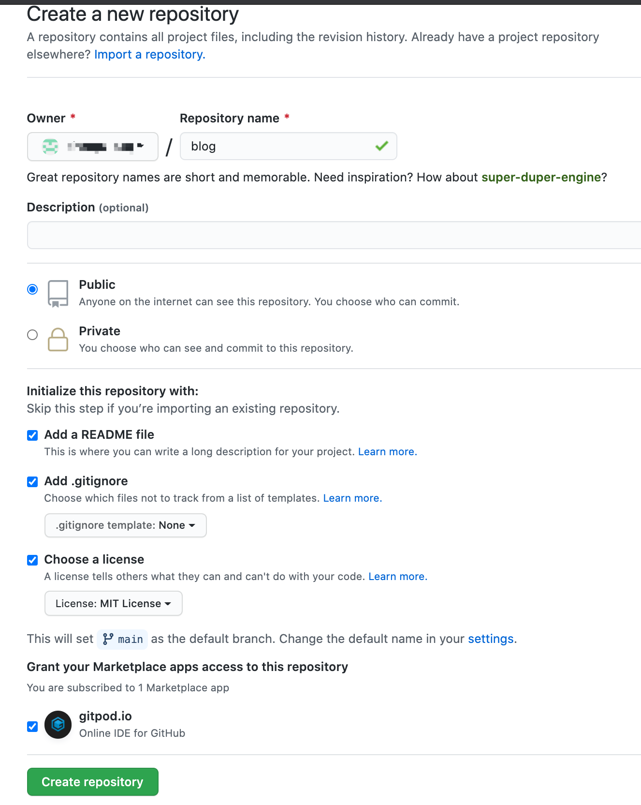
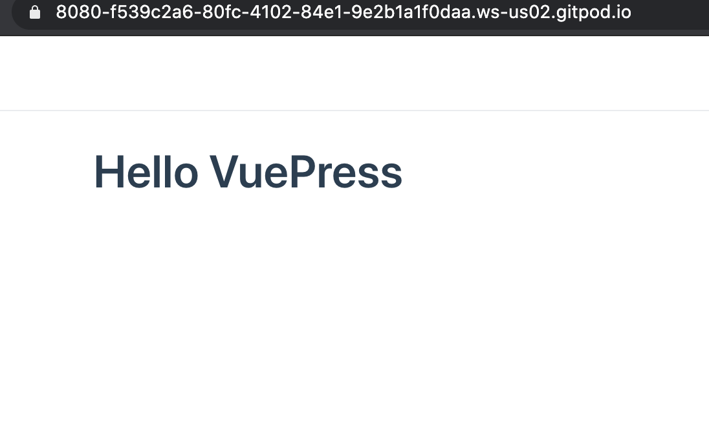

# vuePress 个人博客搭建

## 参考

[vuePress 官方文档](https://vuepress.vuejs.org/zh/guide/getting-started.html)

[vuepress-theme-reco 官方教程](https://vuepress-theme-reco.recoluan.com/views/1.x/installUse.html)

2020-10-15 22:43 开始

## Github 新建仓库



## 安装 vuePress

使用 GitPod

接下来的内容查看 vuePress 官方文档

[vuePress 官方文档](https://vuepress.vuejs.org/zh/guide/getting-started.html)

```shell
yarn init
```

---

```shell
yarn add -D vuepress
```

---

```shell
mkdir docs && echo '# Hello VuePress' > docs/README.md
```

---

添加以下内容到 package.json

```shell
{
  "scripts": {
    "docs:dev": "vuepress dev docs",
    "docs:build": "vuepress build docs"
  }
}
```

结果

```json
{
  "name": "blog",
  "version": "1.0.0",
  "description": "my blog",
  "main": "index.js",
  "repository": "https://github.com/chengziqaq/blog.git",
  "author": "admin@chengziblog.com",
  "license": "MIT",
  "devDependencies": {
    "vuepress": "^1.7.0"
  },
  "scripts": {
    "docs:dev": "vuepress dev docs",
    "docs:build": "vuepress build docs"
  }
}
```

---

```shell
yarn docs:dev
```

显示了 Hello VuePress



## 安装主题

以下内容参考

[vuepress-theme-reco 官方教程](https://vuepress-theme-reco.recoluan.com/views/1.x/installUse.html)

想添加内容时，发现 vuePress 基本配置没搞好。现在来设置一下。

手动创建文件夹。会不会太傻了。vuePress 不能自动生成配置吗？

在 doc 文件夹下新建 `.vuepress`

参考

https://tsanfer.github.io/VuePress-GithubPages-TravisCI/pages/VuePress.html#vuepress-%E7%9B%AE%E5%BD%95%E7%BB%93%E6%9E%84

根目录 package.json

```json
{
  "name": "blog",
  "version": "1.0.0",
  "main": "index.js",
  "repository": "https://github.com/chengziqaq/blog.git",
  "author": "admin@chengziblog.com",
  "license": "MIT",
  "devDependencies": {
    "@vuepress/plugin-active-header-links": "^1.7.0",
    "@vuepress/plugin-medium-zoom": "^11.7.0",
    "@vuepress/plugin-nprogress": "^1.7.0",
    "@vuepress/plugin-back-to-top": "^1.7.0",
    "vuepress": "^1.7.0"
  },
  "scripts": {
    "docs:dev": "vuepress dev docs",
    "docs:build": "vuepress build docs"
  }
}
```

---

```shell
yarn
```

在 .vuepress 文件夹下 新建 config.js，粘贴一下内容

```javascript
module.exports = {
  base: "/VuePress-GithubPages-TravisCI/", //目录根地址，应与Github仓库名字相同
  title: "VuePress + GithubPages + TravisCI", // 显示在左上角的网页名称以及首页在浏览器标签显示的title名称
  description: "创建 VuePress + GithubPages + TravisCI 在线文档", // meta 中的描述文字，用于SEO
  head: [
    [
      "link",
      { rel: "icon", href: "/gamepad_game_128px.ico" }, //浏览器的标签栏的网页图标,基地址/docs/.vuepress/public
    ],
  ],

  //markdown扩展
  markdown: {
    lineNumbers: true, //是否在每个代码块的左侧显示行号
  },

  //默认主题配置
  themeConfig: {
    //导航栏
    nav: [
      //链接页面链接的根地址为/docs
      { text: "思路", link: "/pages/flow.md" },
      { text: "创建Github仓库", link: "/pages/Github.md" },
      { text: "配置VuePress", link: "/pages/VuePress.md" },
      { text: "TravisCI生成和发布", link: "/pages/TravisCI.md" },
      { text: "博客", link: "https://tsanfer.xyz" },
    ],
    sidebarDepth: 2, //侧边栏深度
    //侧边栏
    sidebar: [
      ["/pages/flow.md", "思路"],
      ["/pages/Github.md", "创建Github仓库"],
      ["/pages/VuePress.md", "配置VuePress"],
      ["/pages/TravisCI.md", "TravisCI生成和发布"],
    ],

    // 假定是 GitHub. 同时也可以是一个完整的 GitLab URL
    repo: "Tsanfer/VuePress-GithubPages-TravisCI",
    // 自定义仓库链接文字。默认从 `themeConfig.repo` 中自动推断为
    // "GitHub"/"GitLab"/"Bitbucket" 其中之一，或是 "Source"。
    repoLabel: "Github",
    // 以下为可选的编辑链接选项
    // 假如文档不是放在仓库的根目录下：
    docsDir: "docs",
    // 假如文档放在一个特定的分支下：
    docsBranch: "master",
    // 默认是 false, 设置为 true 来启用
    editLinks: true,
    // 默认为 "Edit this page"
    editLinkText: "在 Github 上编辑此页",

    smoothScroll: true, //页面滚动效果
    lastUpdated: "最后更新", // string | boolean
  },

  //插件
  plugins: [
    "@vuepress/medium-zoom", //zooming images like Medium（页面弹框居中显示）
    "@vuepress/nprogress", //网页加载进度条
    "@vuepress/back-to-top", //返回页面顶部按钮
    "@vuepress/nprogress", //提示加载进度
    "reading-progress", //提示阅读进度
  ],
};
```

---

```shell
yarn add vuepress-theme-reco
```

---

```javascript
// .vuepress/config.js

module.exports = {
  theme: "reco",
};
```
